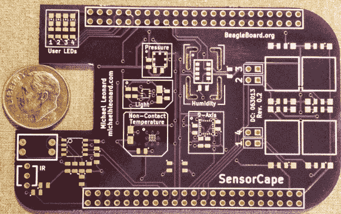

# BeagleBone SensorCape 可以让你测量任何东西

> 原文：<https://hackaday.com/2013/08/02/beaglebone-sensorcape-lets-you-measure-just-about-anything/>

这是 2013 年实习生设计挑战的另一个参赛作品，激励德州仪器的夏季实习生为少数嵌入式平台之一开发一些很酷的东西。这个条目由迈克尔·伦纳德开发，是比格犬黑色的斗篷，上面有一堆不同传感器的脚印。

通过安装温度、压力和湿度传感器，使用它将您的 BeagleBone 变成一个气象站。或者，你可能更喜欢为你的下一个四轴飞行器安装 IMU，在标有“9 轴”的焊盘上安装 MPU-9150 芯片。该器件集加速度计、陀螺仪和数字罗盘于一体。还有一个光线传感器和红外遥控接收器的空间，右侧的大方形垫用作输入按钮的突破口。如果你想知道他为[迈克尔]设计的传感器的所有细节，他在为电路板编写参考手册[方面做得很好。](http://www.michaelhleonard.com/sensorcape-reference/#mpu9150)

[迈克尔]没有给我们发链接，直到他看到了我们周二推出的复古游戏斗篷。大家加油！不要躲在地下室里建东西，除非你要去[告诉我们](http://hackaday.com/contact-hack-a-day/)。

[https://www.youtube.com/embed/pDhNsOiMf9o?version=3&rel=1&showsearch=0&showinfo=1&iv_load_policy=1&fs=1&hl=en-US&autohide=2&wmode=transparent](https://www.youtube.com/embed/pDhNsOiMf9o?version=3&rel=1&showsearch=0&showinfo=1&iv_load_policy=1&fs=1&hl=en-US&autohide=2&wmode=transparent)