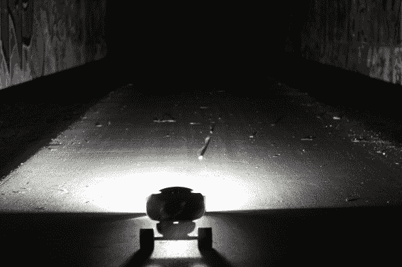

# Beamboarder 让你在晚上滑冰；不会遮挡迎面而来的车流

> 原文：<https://hackaday.com/2014/07/18/beamboarder-lets-you-skate-at-night-wont-blind-oncoming-traffic/>

无论你是用长板作为交通工具还是游乐设施，如果你在光线不好的地方尖叫，晚上的会议可能会很痛苦。无论何时那个巨大的火球出现在地平线上，Beamboarder 都是一个简单的解决方案，可以很容易地放进背包里。

归结起来就是一个大功率 led 和一个锂电池。这算怎么回事？事实上，是这种“垃圾”的感觉(里昂的话，不是我们的话)让我们微笑。一个容量尽可能大的旧硬盘被搜查零件。起初这听起来像一个笑话，但关键是早期的大型驱动器内部有更大的磁铁。你需要一个真正强大的，因为这是所有将举行的领导到我们的董事会前卡车。接下来就是用热粘合剂将一个 CREE LED 连接到锂包，锂包覆盖在收缩管中，以防止元件进入。

大灯在板下，对迎面而来的车流彬彬有礼。一旦你实现了这一点，我们相信你会想走得更远，所以我们建议[带 LED 视点显示的轮子](http://hackaday.com/2012/11/16/pov-wheels-for-a-longboard/)，并且总是有选择[变成全电动](http://hackaday.com/2013/12/27/motorized-longboard/)。