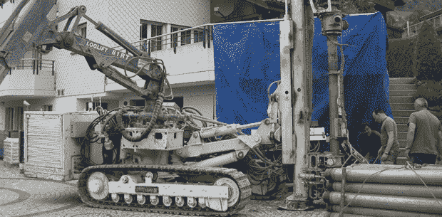

# 用地热冷却战胜炎热

> 原文：<https://hackaday.com/2013/07/23/beating-the-heat-with-geothermal-cooling/>

不久前，[Erich]的燃油加热系统需要进行一些维修。考虑到燃油价格的上涨，以及瑞士政府的一些激励措施，他决定采用一种更加绿色的供暖方案——地热供暖。该系统在冬天运行良好，但在夏天基本没用。[Erich]决定将他的 180 米投资用于夏季供暖，并以相当低的投资和最低的成本将他的地热供暖系统[改造成冷却系统](http://mcuoneclipse.com/2013/07/13/hacking-the-heating-system-for-cooling-geothermal-drilling-with-extra-benefits/)。

储备系统的工作原理是将冷液体从[Erich]的地暖系统中泵入地下。冬天，地表总是比地面冷，因此[Erich]的家就有暖气。在夏天，情况正好相反，凉爽的土地被炙烤的地表所隔绝。逆转加热系统所需要的只是对加热控制器做一些小小的改动。

Stock，[Erich]的热泵控制器没有反向运行系统的能力，所以他求助于一个 [Freescale 板](http://www.freescale.com/webapp/sps/site/prod_summary.jsp?code=FRDM-KL25Z)来关闭压缩机并打开泵。有了这些额外的东西，[Erich]用 50 瓦将 1.5 千瓦的热量直接泵入地下，这是一个相当有效的冷却系统，如果你已经有了地热设置，基本上是免费的。