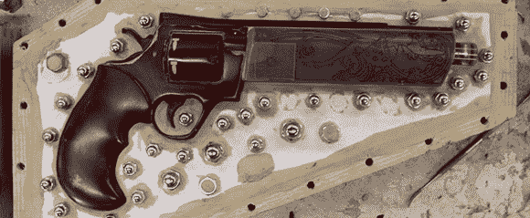

# 美丽的副本团队堡垒 2 武器

> 原文：<https://hackaday.com/2013/03/06/beautiful-replica-team-fortress-2-weapons/>

我们已经看到了我们的复制道具，但[内森]的副本是《堡垒 2》中间谍的佩枪。

这款产品最初是一款现成的气枪。移除桶和圆筒后，[Nathan]使用 Apoxie 造型和大量打磨将一块金属和塑料原料变成了直接来自 Mann Co .商店的东西。游戏中的大使还包括一个间谍感情对象的雕刻，由[内森]用一些非常仔细的 Dremel 作品复制。道具完成后，[内森]用胶合板做了一个模具盒，里面填充了硅橡胶。这让他能够为他的道具武器铸造几个铸件

这不是[内森]唯一的 TF2 复制品道具；他还复制了库存狙击炮和侦察兵的散弹枪，以及来自边疆的扩音器。为了超越自己，[内森]正准备造一把枪，它能以每分钟一万发的速度发射两百美元的定制子弹。他还没有制作任何帽子。