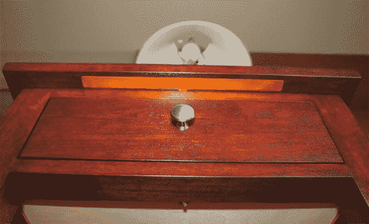

# 漂亮的触摸感应家具

> 原文：<https://hackaday.com/2013/11/21/beautiful-touch-sensitive-furniture/>

花了一年多的时间，但[修补技术专家]终于完成了他的触摸感应床头柜。乍一看，它就像任何一件普通的家具。加上一个 Arduino、一些覆铜板和几个 led，他把它变成了一个非常优雅的电子家居装饰。

床头柜是由几块非常漂亮的红木制成的。在床头柜顶部的下面，三块 Kapton 覆铜板沿着前边缘和侧边缘嵌入。这些电容感测板连接到 Arduino Fio，Arduino Fio 读取这些传感器的电容，并打开抽屉下的小 LED 或市电灯。

电子设备由隐藏在床头柜顶部下方的小型 USB 充电器和备用电池供电。抽屉内的磁簧开关会在抽屉打开时打开 RGB LED。

虽然床头柜本身是一件美妙的木工作品，但我们需要为精致的家具和电子产品的无缝集成脱帽致敬。我们通常看到的电子家具改装是 Ikea cruft，但这种奇妙的自制床头柜应该可以使用几十年或几个世纪。

[技术人员]在下面检查他的构建的视频

[https://www.youtube.com/embed/1Jc8xOqxZeU?version=3&rel=1&showsearch=0&showinfo=1&iv_load_policy=1&fs=1&hl=en-US&autohide=2&wmode=transparent](https://www.youtube.com/embed/1Jc8xOqxZeU?version=3&rel=1&showsearch=0&showinfo=1&iv_load_policy=1&fs=1&hl=en-US&autohide=2&wmode=transparent)