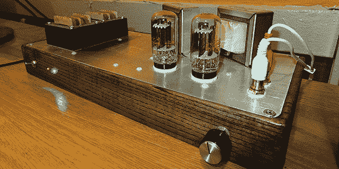

# 美丽的电子管放大器使用电视管

> 原文：<https://hackaday.com/2012/12/16/beautiful-tube-amp-uses-a-tv-tube/>

我们看到的大多数音频电子管放大器都使用普通电子管——通常是 12AX7 的前置放大器和一个更普通的功率电子管，如 EL34。另一方面，[丹尼尔]，[决定用 13EM7 制作自己的音频电子管放大器](http://xellers.wordpress.com/audio/13em7-tube-amplifier/)，这种电子管最初用于电视机的垂直振荡器。由此产生的项目是一个美妙的立体声放大器，听起来真的很好，启动。

[Daniel]从[Fred Nachbaur]的[mini blok SET 放大器](http://www.dogstar.dantimax.dk/tubestuf/miniblk1.htm)中获得了使用 13EM7 电子管的想法。这个非常小的 1 瓦电子管放大器使用的是一根原本为老式电视机设计的电子管。这个构造背后的秘密是，这个电子管实际上是一个封装中的两个三极管；13ME7 的一侧增益很大，但功率不大，非常适合前置放大器。另一面有很大的功率，可以为扬声器提供两瓦特的功率。

在[丹尼尔]为他的功放蚀刻了几块电路板后，他铣出一块木头做底盘。当所有东西都装好后，他有了一个看起来很棒的立体声放大器，听起来也很棒。