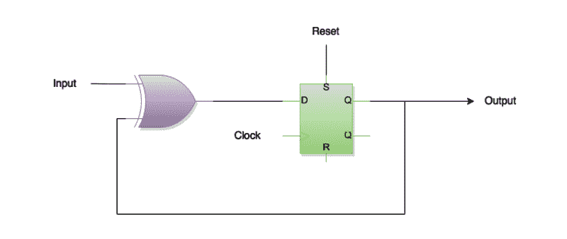

# 成为状态机设计大师

> 原文：<https://hackaday.com/2015/08/13/becoming-a-state-machine-design-mastermind/>

想象一个有全方位碰撞传感器的机器人。对碰撞传感器激活的响应取决于机器人先前的状态。如果它一直向前，一个碰撞会把它向后推，反之亦然。这个机器人表现出的行为很容易被建模为状态机。也就是说，机器的输出(电机驱动)不仅取决于输入(碰撞传感器)，还取决于机器的当前状态(前进或后退)。

就状态机而言，这并不特别复杂。许多状态机有许多复杂条件的状态。例如，考虑一个电话交换机。对电话摘机的反应取决于线路的状态。如果状态为振铃，则拿起电话进行连接。如果状态为空闲，电话会听到拨号音。交换机还必须有超时、连接失败、三方通话等状态。

如果你掌握了状态机，你的设计和调试周期将会更快。一部分是理解，一部分是了解你可以选择使用的工具。我将在下面讨论这两个问题。

## 软件

您可以用软件或硬件实现状态机。机器人状态机的软件版本可能如下所示:

```
state = FORWARD;
while (true) // do forever
 {
 if (bump)
    if (state==FORWARD) state=REVERSE; else state=FORWARD;
 if (state==FORWARD) move_forward(); else move_backward();
 }
```

获得相同效果的另一种方法是编写一个程序，从匹配输入和当前状态的表中读取数据，以找到下一个状态。例如:

```
table[0].current_state=FORWARD;
table[0].bump_input=TRUE;
table[0].next_state=REVERSE;
table[1].current_state=REVERSE;
table[1].bump_input=TRUE;
table[1].next_state=FORWARD;
```

## 触发器硬件

硬件实现使用触发器，并且至少有两种不同的方法来构造状态机。让我们让我们的机器人更聪明一点。假设您希望机器人每次改变方向时都走得慢一些，但如果它在没有撞到东西的情况下完成了三个循环(或者时钟周期，如果您愿意的话)，机器人应该会加快速度。有几种方法可以做到这一点。使用计数器是有意义的，但这不是设置它的唯一方法。考虑以下状态:

*   慢速前进(1)
*   慢速前进(2)
*   慢速前进(3)
*   倒档减速(1)
*   倒档减速(2)
*   倒车慢行(3)
*   向前
*   反面的

上面的状态图是考虑和记录状态机的习惯方式。我将很快告诉你我用来创建它的工具。每个状态机都有一个起始状态(带双环的那个)。圆圈代表状态，箭头代表从一种状态转换到另一种状态的事物。

## 国家代表权

在软件中，用一个数字(也许用#define 更容易阅读)或一个枚举值来表示每个状态是有意义的。对于硬件设计，您需要选择一种方式来表示每个状态。最明显的选择是简单地使用存储在寄存器或触发器中的数字。这很紧凑，但是需要使用组合逻辑(`AND`、`OR`和`INVERTER`门)解码每个状态。如果不小心，当状态表示中的多个位同时改变时，您还可能触发虚假状态。当然，状态没有理由必须使用顺序号，所以您可以选择格雷码(每次状态转换只有一位发生变化)。

更极端但非常普遍的是 [one hot 编码方法](http://www.unm.edu/~zbaker/ece238/slides/19.pdf) (PDF)。这里，每个状态使用一个触发器，因此在任何给定时间只有一个触发器被置位。这需要初始化来设置第一状态或特殊逻辑，以允许状态 0 成为起始状态。但速度快，减少解码逻辑，所以常用。

## 摩尔 vs 米利

实现硬件状态机有两种常见的策略:Moore 机器和 Mealy 机器。摩尔机器仅使用状态信息创建输出。这意味着任何唯一的输出集都需要一个单独的状态。对于一个热机器，我们假设的机器人需要 8 个触发器:两组 3 个用于慢速状态，另外两组用于正常状态。

在[一个摩尔机器](https://en.wikipedia.org/wiki/Moore_machine)中，输出(比如说正向、反向和慢速)将源自连接到状态机输出的一些逻辑门(例如，`OR`门将从任何正向状态产生正向信号)。

另一种选择是[一台粉状机器](https://en.wikipedia.org/wiki/Mealy_machine)。对于 Mealy 机器，输出也取决于输入。这需要仔细设计，因为随着情况的变化，它可能会产生输出毛刺。然而，它通常需要较少的状态，因为相似的输出被分组。

以我们的机器人为例，想象一下驱动系统为你提供了以给定的速度和方向行走的多个步骤。你接收 8 位输入。每次改变电机方向或速度时，这些位从零开始计数，直到达到最大计数。你决定保持慢速模式，直到计数达到 100。此外，假设每个方向有两个输出:前进慢速、前进、后退慢速和后退。

如果你做一个简单的实现，一个摩尔机器需要上百个状态。对于 Mealy 机器，输出不仅取决于状态，还取决于驱动器计数器的值。当然，如果计数器是状态机的一部分，那么它就是一个摩尔机器。事实上，你总是可以将摩尔机器转换成 Mealy 机器，反之亦然。

选择通常很明确。如果你关心速度和状态表示的大小，你想要一个 Mealy 机器。如果你不想有输出故障的机会，使用摩尔机器。

## 最佳化

例如，除了选择编码和机器类型，还有机会通过组合等价的状态来最小化状态机。这听起来很容易，但它会很快变得复杂。

幸运的是，有一些自动化工具(包括用于 FPGA 开发的工具)可以最小化状态机。不过，在某些情况下，最小的状态机会导致输出解码或其他相关逻辑变得不必要的复杂。

## 实际例子

考虑同步串行数据流(即带时钟的串行数据流)。数据应该具有奇数奇偶校验，这意味着如果数据流具有奇数个 1 位，则奇偶校验位为 0，否则奇偶校验位为 1。数据流中 1 位的计数连同奇偶校验位将总是加起来是一个奇数。从状态机的角度来看，这相当简单，如下图所示。

复位状态(蓝色粗线)假设没有 1 位或偶数，因此输出为 1(因此是奇数)。只要零比特到达，状态就保持不变。当出现 1 位时，状态变为奇数，输出变为零。机器保持在该状态，直到它接收到另一个 1 位。

你如何实现这样的东西？考虑这个状态表:

```
Current State      Input       Next State
0                    0         0
0                    1         1
1                    0         1
1                    1         0

```

这看起来眼熟吗？应该的。这正是一个`XOR`门的真值表。输出位表明我们可以使用一个状态变量(0 =奇数，1 =偶数)。这里有一个简单的逻辑实现:



或者如果你喜欢 [Verilog](http://www.edaplayground.com/x/JUw) :

```
module parity(input reset, input clk, input data, output par);
 reg state;
 always @(posedge clk)
 begin
 if (reset) state<=1'b1;
 else state<=state^data;
 end
endmodule;
```

注意^字符是 Verilog(和 c)的`XOR`。

## 自动化状态机开发

没有什么可以阻止你用 Verilog 或 VHDL 创建你自己的状态机，就像奇偶校验位的例子一样。然而，有一些自动化工具(从免费的开源到非常昂贵的)可以让你将状态机描述为表格或状态图，很多工具甚至可以为你生成代码。

一个工具是 [Fizzim](http://www.fizzim.com) ，开源易用。它生成了好看的图(就像上面的图)，所以即使你不想生成代码，你可能还是想检查它。Fizzim 使用 Java 作为 GUI，所以它几乎可以在任何地方运行。它使用 Perl 作为后端代码生成器，同样，这是非常可移植的。

如果您想继续操作文本，您实际上不必使用 GUI，但是 GUI 非常方便。有三种对象类型:状态机、状态和转换。每个元素都有描述后端 Perl 程序不同内容的属性。

Fizzim 教程非常值得一读，即使你可能不想使用 Fizzim。在展示该工具的过程中，他们还涵盖了 Verilog 中状态编码、输出生成和编码状态机的实际细微差别。最新版本也可以输出 VHDL。

## 软件库

如果你喜欢用软件来实现你的状态机，有很多选择(如果你不想使用你自己的)。C++程序员流行的 Boost 库是一种选择。甚至还有 Arduino 的选项[。Java 程序员](http://playground.arduino.cc/Code/FiniteStateMachine)[也有选项](https://github.com/oxo42/stateless4j)。

有很多其他的可能性。如果你喜欢网络开发，JavaScript 中有一个框架。甚至有一个用于指定和执行状态机的 XML 标准的 W3C 草案[。另一个有趣的工具是](http://commons.apache.org/proper/commons-scxml/) [Ragel 编译器](http://www.colm.net/open-source/ragel/)，它可以生成各种语言的目标代码。

## 家庭作业

一旦你习惯了思考状态机，你会发现它们无处不在。机器人、交通灯、防盗警报器和恒温器可以使用状态机实现。当然，你可以走极端。(灯开关有两种状态:开和关。)然而，对于中等复杂到非常复杂的系统来说，状态机是一种可行的方法。

对于简单的机器，您可能想要自己定制实现。但是，如果您可以使用现有的软件或硬件实现工具，您可能会有更好的体验。