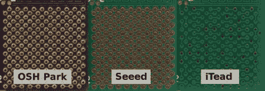

# PCB 制造中的钉床和精度

> 原文：<https://hackaday.com/2012/09/11/bed-of-nails-and-accuracy-in-pcb-manufacturing/>

几天前，我们在 Kickstarter 上提到了新的 ARM 驱动的 [Teensy 3.0 项目。创造者[Paul Stoffregen]决定在他的 Kickstarter](http://hackaday.com/2012/09/05/meet-the-teensy-3-0/) 更新中分享建立测试夹具的试验，以及不同 PCB 制造商[的令人震惊的准确性比较。](http://www.kickstarter.com/projects/paulstoffregen/teensy-30-32-bit-arm-cortex-m4-usable-in-arduino-a/posts/305527)

因为[Paul]的 Teensy 3.0 的 IO 引脚比这么小的电路板上应该有的多，所以验证电路板是否有缺陷的测试夹具相当复杂。为了测试每块电路板，一个小东西被放在几十个弹簧加载的触点上，这些触点排列得像一张钉床。从那里，另一个 Teensy(这次是 Teensy 2.0)通过用几种模式循环通过所有的管脚来执行一些测试。

因为弹簧加载触点需要在他的测试夹具的 PCB 上钻相当精确的孔，[Paul]认为比较几个电路板室的精度会很简单。在这篇文章的标题图片中(点击进入 embiggen)，【保罗】展示了[奥什公园](http://www.oshpark.com/)、 [Seeed 工作室](http://www.seeedstudio.com/depot/fusion-pcb-service-p-835.html?cPath=185)和 [iTead 工作室](http://iteadstudio.com/)的能力。如果高质量的钻探工作是你下一个项目的必要要求，这一课可能是和一家美国公司一起上的。