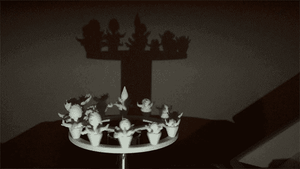

# 在电影出现之前，有佐伊特罗普斯。现在我们有了 3D 打印的人造宝石！

> 原文：<https://hackaday.com/2015/03/25/before-film-there-were-zoetropes-now-we-have-3d-printed-zoetropes/>

Reddit 用户【eyelandarts】制作了一个相当独特的 3D 打印项目。一个 3D 打印的[窥镜。](http://imgur.com/a/on0kD)

你看， [zoetrope](http://en.wikipedia.org/wiki/Zoetrope) 是一种在电影技术出现之前创造动画效果的设备。它会创造出一种运动的幻觉，就像一本翻书一样，但是有一个旋转的圆柱形壁，上面开有槽。当圆柱体旋转时，您可以通过窗口瞥见动画。但是，这只是一个二维动画——如果你用一个不断变化的三维模型来代替它会怎么样？

实际上以前也有人做过。事实上很久以前。1887 年，[艾蒂安-朱尔斯·马雷]创造了一个巨大的窥镜来制作飞行中的鸟的石膏模型。快进到今天，[eyelandarts]已经 3D 打印出类似的东西——但抛弃了圆柱形的墙壁。相反，闪光灯是用来看动画的！

如果我们自己这么说的话，最终的结果是相当令人敬畏的。另一个有趣的 Zoetropes——用微型液晶显示屏制作的数码相机怎么样？

Siezure-warning…如果你有足够的勇气观看这样的东西，休息后会嵌入一个非常 flash-tastic 的演示 gif。

[via [reddit](https://www.reddit.com/r/3Dprinting/comments/304zsd/3d_printed_zoetropes_properly/)