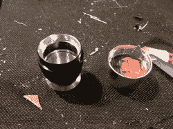
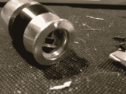
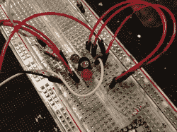
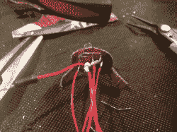
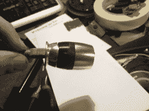
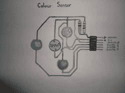

# 初学者项目:用 RGB 发光二极管和一个光电池感知颜色

> 原文：<https://hackaday.com/2012/11/05/beginner-project-color-sensing-with-rgb-leds-and-a-photocell/>

[https://www.youtube.com/embed/3n2sH22EiFM?version=3&rel=1&showsearch=0&showinfo=1&iv_load_policy=1&fs=1&hl=en-US&autohide=2&wmode=transparent](https://www.youtube.com/embed/3n2sH22EiFM?version=3&rel=1&showsearch=0&showinfo=1&iv_load_policy=1&fs=1&hl=en-US&autohide=2&wmode=transparent)

我已经看过几次“真实世界滴管”的概念艺术了。不过，我还没有注意到有任何产品上市。不是技术阻止了它们，颜色采样可以有一百万种方式。我选择了一个最简单的方法，很快就做好了一些东西。

我选择的方法是[Fjordcarver]在说明书中非常详细地概述的。我接受了他的项目，用 Teensy2 代替 arduino，并使用单独的红色、蓝色和绿色 led，因为我周围有一些。他包括了这样做的示意图，所以，再一次，功劳归于他。【Fjordcarver】还做了一个加工草图来展示颜色。我想实际使用这个，所以我添加了一个小功能，任何击键都会将十六进制颜色复制到剪贴板。这样，我就可以让“滴管”运行，并在任何我想要的时候采样。

[](https://hackaday.com/wp-content/uploads/2012/11/img_0590.jpg)[](https://hackaday.com/wp-content/uploads/2012/11/img_0592.jpg)[](https://hackaday.com/wp-content/uploads/2012/11/img_0593.jpg)[](https://hackaday.com/wp-content/uploads/2012/11/img_0594.jpg)[](https://hackaday.com/wp-content/uploads/2012/11/img_0595.jpg)[](https://hackaday.com/wp-content/uploads/2012/11/img_0597.jpg)[](https://hackaday.com/wp-content/uploads/2012/11/img_0598.jpg)[](https://hackaday.com/wp-content/uploads/2012/11/fjordcarvers_schem.jpg)

```

import processing.serial.*;
import java.awt.datatransfer.*;
import java.awt.Toolkit;

String buff = &quot;&quot;;
int val = 0;
int wRed, wGreen, wBlue;
String col = &quot;ffffff&quot;;
ClipHelper cp = new ClipHelper();

Serial port;

void setup(){

size(200,200);
 port = new Serial(this, &quot;COM3&quot;, 9600); //remember to replace COM20 with the appropriate serial port on your computer
}

void draw(){
 background(wRed,wGreen,wBlue);
 // check for serial, and process
 while (port.available() &gt; 0) {
 serialEvent(port.read());
 }
}

void keyPressed() { cp.copyString(&quot;&quot;+col); }
void serialEvent(int serial) {

if(serial != '\n') {
 buff += char(serial);
 }
 else {
 int cRed = buff.indexOf(&quot;R&quot;);
 int cGreen = buff.indexOf(&quot;G&quot;);
 int cBlue = buff.indexOf(&quot;B&quot;);

if(cRed &gt;=0){
 String val = buff.substring(cRed+3);
 wRed = Integer.parseInt(val.trim());
 }
 if(cGreen &gt;=0){
 String val = buff.substring(cGreen+3);
 wGreen = Integer.parseInt(val.trim());
 }
 if(cBlue &gt;=0){
 String val = buff.substring(cBlue+3);
 wBlue = Integer.parseInt(val.trim());
 }
 col = hex(color(wRed, wGreen, wBlue), 6);
 buff = &quot;&quot;;
 }

}

// CLIPHELPER OBJECT CLASS:

class ClipHelper {
 Clipboard clipboard;

 ClipHelper() {
 getClipboard();
 }

 void getClipboard () {
 // this is our simple thread that grabs the clipboard
 Thread clipThread = new Thread() {
 public void run() {
 clipboard = Toolkit.getDefaultToolkit().getSystemClipboard();
 }
 };

 // start the thread as a daemon thread and wait for it to die
 if (clipboard == null) {
 try {
 clipThread.setDaemon(true);
 clipThread.start();
 clipThread.join();
 }
 catch (Exception e) {}
 }
 }

 void copyString (String data) {
 copyTransferableObject(new StringSelection(data));
 }

 void copyTransferableObject (Transferable contents) {
 getClipboard();
 clipboard.setContents(contents, null);
 }

 String pasteString () {
 String data = null;
 try {
 data = (String)pasteObject(DataFlavor.stringFlavor);
 }
 catch (Exception e) {
 System.err.println(&quot;Error getting String from clipboard: &quot; + e);
 }
 return data;
 }

 Object pasteObject (DataFlavor flavor)
 throws UnsupportedFlavorException, IOException
 {
 Object obj = null;
 getClipboard();

 Transferable content = clipboard.getContents(null);
 if (content != null)
 obj = content.getTransferData(flavor);

 return obj;
 }
}

```