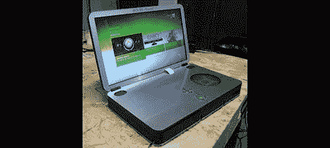

# [Ben Heck]制造了他有史以来最小的 360 笔记本电脑

> 原文：<https://hackaday.com/2012/10/24/ben-heck-builds-his-smallest-360-laptop-ever/>

[Ben Heck]对构建 Xbox 360 笔记本电脑并不陌生。多年来，他已经制造了几十台，但在本周的本·赫克秀中，他将挑战并制造有史以来最小的 Xbox 笔记本电脑。

最新和最棒的 Xbox 笔记本电脑是基于最新和最小的 199 美元的 4gb Xbox。不过，为了将这款游戏机变成笔记本电脑，必须做出一些妥协:原本用于 Kinect 的电源被重新用于为非常薄的 15.6 英寸 LED LCD 供电，而为硬盘供电的端口被用于驱动 perfboard 立体声放大器。你可以在这里查看官方【本·赫克】的博文[。](http://benheck.com/xbox-360-portable-2012)

最终版本非常紧凑，比[Ben Heck]以前的 Xbox 笔记本电脑版本小得多。只有 2.125 英寸厚，16 英寸宽，9 英寸长，这很可能是可能制造的最小的 Xbox。如果没有微软的新硬件版本(目前看来不太可能)，这可能是 Xbox 360 笔记本电脑的最小版本。我们向[本]脱帽致敬，祝他在下一季的《本·赫克秀》中好运。