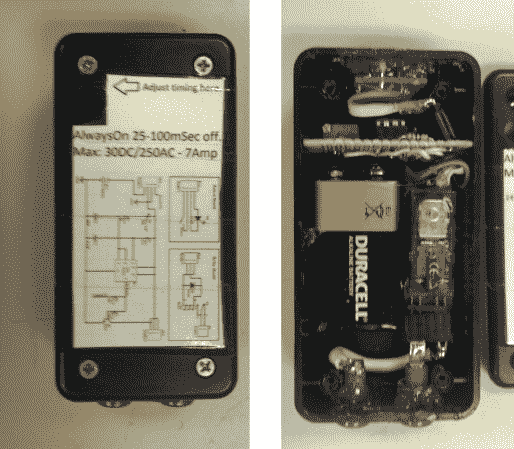

# 包含在最终项目中的最佳实践

> 原文：<https://hackaday.com/2013/07/09/best-practices-to-include-in-your-final-projects/>

做最后的努力来完成你的项目可能有点令人畏惧。这有点像建筑项目的竣工清单——添加开关板、填充踢脚板上的钉孔、拧上灯泡、清洁窗户——这些东西很快就会加起来。但是在整个开发阶段记住一套最佳实践将会减轻这个负担。[Caleb P.] [刚刚发布了一个快速指南](http://cpprojects.blogspot.com/2013/07/small-build-big-execuition.html)，以最近的一个项目为例。

首先也是最重要的是项目盒盖上的标签。有多少次你拿出一个一两年前的电路板，却无法弄清楚引脚排列？就像古代的电视和收音机一样，包括服务示意图将为您节省大量时间！他还提到，箱子中组件的大小和方向一直在他的脑海中。这一点得到了回报，因为一切都非常合适。[Caleb]确保电池很容易拿到，每个组件都有某种类型的连接器，以便无需焊接即可拆卸和维修/更换。这本指南当然没有什么突破性的东西。但是问问你自己:在我自己的工作中，我是否遵循了所有这些指导方针？