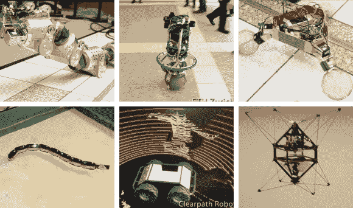

# 2013 年 ICRA 最佳机器人演示

> 原文：<https://hackaday.com/2013/06/18/best-robot-demos-from-icra-2013/>

2013 年 IEEE 机器人与自动化国际会议于 5 月初召开。这里有一段在活动中展示的几个机器人的视频剪辑。看起来参加会很有意思，但至少你可以从如此广泛的例子中获得一些灵感。

我们抓取了半打引起我们注意的截图。从左上角开始顺时针方向移动，我们有一个分段的蠕虫机器人，它使用滚轮来移动。大厅里正在进行一场有趣的接球游戏，使用的是这种球形自动平衡器。谁会想到用打线器当轮子？可能是右上角开发三脚架的团队。就在下面有许多飞行项目中的一个，一个中心看起来像一对螺旋桨的机器人。中间的漫游者正在展示它创建的 3D 地形图来寻找它的路。最后，有人建了一个水池让这条蛇在里面游泳。

[https://www.youtube.com/embed/V8weU0k_P2c?version=3&rel=1&showsearch=0&showinfo=1&iv_load_policy=1&fs=1&hl=en-US&autohide=2&wmode=transparent](https://www.youtube.com/embed/V8weU0k_P2c?version=3&rel=1&showsearch=0&showinfo=1&iv_load_policy=1&fs=1&hl=en-US&autohide=2&wmode=transparent)

[谢谢迈克尔]