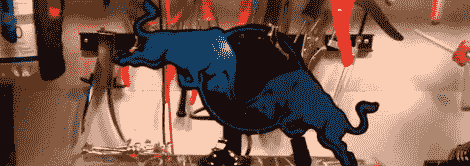

# 用 Bullduino 开车更好

> 原文：<https://hackaday.com/2012/06/25/better-driving-with-a-bullduino/>

尽管你可能已经从在塔可钟停车场闲逛的孩子们那里听说了什么，关于保守驾驶还是有很多要说的。闯红灯和停车标志后不停车会对你的引擎寿命产生奇迹，在离十字路口 50 英尺远的地方不猛踩刹车会让你的刹车片工作很长时间。[aromaoftacoma]想要一个仪表盘来显示他是一个多好的司机，所以当他得到一个 bullduino 时，他知道他必须做什么。

【aromaoftacoma】为[红牛创作大赛](http://hackaday.com/2012/06/15/redbulls-new-creation-contest-comes-to-your-workshop/)设计的项目使用了非常酷的[Arduino shield/红牛标志](http://hackaday.com/2012/06/23/red-bull-creation-hardware-bullduino-arrives/)，被称为 bullduino，带有一个加速度计来跟踪他驾驶的保守程度。快速停车和启动对汽车来说是谋杀——这和你祖母 20 年来一直拥有同一辆车的原因是一样的——所以[aromaoftacoma]在每头冲过来的公牛后面用红色和蓝色的发光二极管做了一个精彩的展示。

因为简单地闪烁 LED 来响应从加速度计中提取的数据有点无聊，[aromaoftacoma]增加了一个伺服系统来改变充电公牛的方向。当他开得好的时候，蓝牛是向上倾斜的，当他突然停下来的时候，红牛就成了关注的焦点。一点也不差。

休息之后你可以看看[aromaoftacoma]的构建视频。

[https://www.youtube.com/embed/74gQsoUsjLs?version=3&rel=1&showsearch=0&showinfo=1&iv_load_policy=1&fs=1&hl=en-US&autohide=2&wmode=transparent](https://www.youtube.com/embed/74gQsoUsjLs?version=3&rel=1&showsearch=0&showinfo=1&iv_load_policy=1&fs=1&hl=en-US&autohide=2&wmode=transparent)