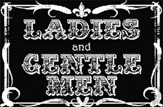

# (更好)第一台 PC 上的全动态视频

> 原文：<https://hackaday.com/2014/06/21/better-full-motion-video-on-the-first-pc/>

十年前，[Trixter]为最初的个人电脑 IBM 5150 制作了演示版 8088 Corruption，它使用 CGA 卡和 SoundBlaster 显示全动态视频。它在当时被誉为 demoscene 的奇迹，当它最终上传到谷歌视频时获得了大量点击，甚至被新生的 hack aday 选中。现在，十年过去了，七年前[Trixter]说使用 CGA 适配器的*图形模式*制作全动态视频是不可能的，[对他早期的作品](http://trixter.oldskool.org/2014/06/19/8088-domination-post-mortem-part-1/)进行了改进。现在，在一台 30 年前的电脑上以每秒 30 帧的速度显示 640×200 分辨率的视频已经成为可能。

[Trixter]的早期作品使用 CGA 适配器的文本模式，只是因为 40×25 字符、16 色模式是唯一可以在每一帧完全更新的图形模式。这仍然是 PC 演示场景的高潮之一，[但从原始视频](https://www.youtube.com/watch?v=H1p1im_2uf4)中，很容易看出其局限性。

不久前，[Trixter]说用他电脑的图形模式显示视频是不可能的。他花了很多年来思考这句话，最终意识到他错了。像现代视频编解码器的开发人员一样，[Trixter]意识到您不需要更改每帧的每个像素:您只需要更改不同帧的像素。显而易见，如果你仔细想想，所有[Trixter]需要做的就是将视频编码成一种格式，这种格式只会在帧与帧之间改变不同的像素，并管理磁盘和内存带宽。

在为图形模式重新编码了 10 年的演示之后，[Trixter]转向了他迄今为止最雄心勃勃的演示:在 8088 上播放[“坏苹果”动画](http://www.youtube.com/watch?v=p5CFu5rOvGs)。正如你在下面的视频中看到的，这是一次彻底的成功。

 [https://www.youtube.com/embed/MWdG413nNkI?version=3&rel=1&showsearch=0&showinfo=1&iv_load_policy=1&fs=1&hl=en-US&autohide=2&wmode=transparent](https://www.youtube.com/embed/MWdG413nNkI?version=3&rel=1&showsearch=0&showinfo=1&iv_load_policy=1&fs=1&hl=en-US&autohide=2&wmode=transparent)