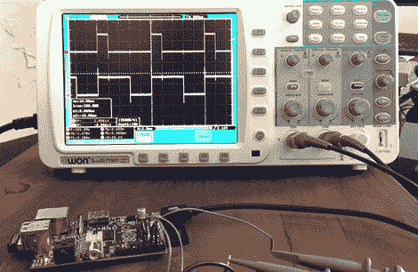

# 树莓 Pi 上更好的 PWM

> 原文：<https://hackaday.com/2013/02/10/better-pwm-on-the-raspberry-pi/>

[Thomas]想玩几个大功率 led 和一个 RaspberryPi。LED 控制器通常需要某种形式的 PWM 来改变 LED 的亮度，不幸的是 Pi 只有一个 PWM 引脚。[Thomas]可以用一个定制的芯片甚至一个挂在 Pi 的 USB 端口上的 Arduino 来解决这个问题。[他选择了基于软件的 PWM](http://www.tbideas.com/blog/2013/02/controling-a-high-power-rgb-led-with-a-raspberry-pi/) ，并且以一种远胜于用钻头敲打引脚的方式做到了这一点。

传统观点认为，没有实时操作系统的 PWM 是愚蠢的——就像在亚洲发动一场陆地战争一样。在 while 循环中打开和关闭一个引脚*会*耗尽 Pi 中所有的处理器能力，所以[Thomas]寻找一种更好的方法来做事情。他偶然发现了由理查德·赫斯特设计的伺服爆破器项目，该项目通过直接内存访问产生不同长度的脉冲；[Richard]创建了一个每 10μs 读取一次的循环缓冲区。缓冲区中有 2000 个值，他可以控制 8 个不同的引脚，而对 CPU 的使用几乎没有影响。

然而，对[托马斯]来说，[理查德]的项目还不够。它最初是为伺服系统编写的，只能驱动高达约 12%的 PWM 引脚。快速重写[Richard]的代码使[Thomas]能够控制 8 个引脚，PWM 从 0%到 100%不等，并能够在此过程中用他的 Pi 做其他事情。

[Thomas]现在有一个 40 瓦的 RGB LED，由一个烧在他视网膜上的树莓 Pi 供电，并满足于给 Pi 更多 PWM 引脚的一种非常聪明的方式。