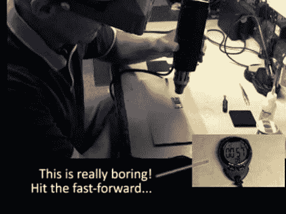

# 带脱漆剂和秒表的 BGA 焊接

> 原文：<https://hackaday.com/2012/08/27/bga-soldering-with-a-paint-stripper-and-stopwatch/>

刚从工厂收到一套闪亮的印刷电路板[Devbisme]需要一种方法将主芯片焊接到位。它有一个球栅阵列，这是众所周知的难以在家庭实验室填充。但是他让它看起来很简单，并且[决定分享一个视频教程。](http://devbisme.webfactional.com/blogs/devbisme/2012/08/24/mounting-bga-pcb-quickly-and-cheaply)

他使用的主要工具是上面看到的脱漆剂(热风枪)。由于他没有自己的花式回流焊炉，他用枪作为热源来工作。首先，他在电路板上的 BGA 封装上涂上一层厚厚的液态助焊剂。接下来，他在烙铁顶端熔化一些焊料，并用它来给电路板上的所有 BGA 焊盘上锡。然后就到了芯片定位的关键步骤。他使用真空镊子将它固定到位，并使用传统镊子微调它的位置。从这里开始，他用脱漆剂加热两分钟，从电路板上方开始，慢慢靠近，在焊接过程结束时反向移动。冷却后，用蒸馏水清洗电路板，并用压缩空气吹干。目视检查后，他在 300 度的烘箱中停留 30 分钟，完成应用。为了您的方便，我们在休息后加入了视频。

我们已经看到类似的技术被用于替换已经组装好的电路板上的芯片。

[https://www.youtube.com/embed/C_oAl4bcQWE?version=3&rel=1&showsearch=0&showinfo=1&iv_load_policy=1&fs=1&hl=en-US&autohide=2&wmode=transparent](https://www.youtube.com/embed/C_oAl4bcQWE?version=3&rel=1&showsearch=0&showinfo=1&iv_load_policy=1&fs=1&hl=en-US&autohide=2&wmode=transparent)