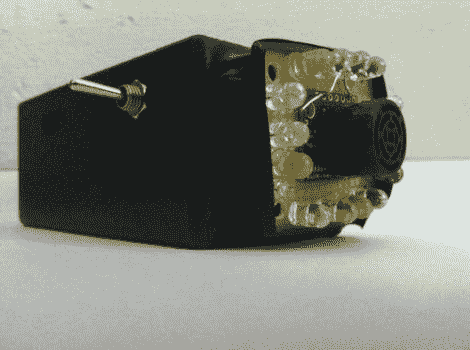

# 自行车警报告诉司机后退

> 原文：<https://hackaday.com/2012/06/04/bike-alert-tells-drives-to-back-off/>

骑自行车上下班的人经常与司机争夺路上的空间。[吊床男孩]所有的通勤都靠两个人力驱动的轮子，他对不被车撞很感兴趣。他决定发挥自己的爱好技能，制造一个能帮助他保持安全的装置。这不仅仅是一个尾灯，它还是一个传感器，汽车越靠近自行车的后部，传感器发出的光就越亮。

传感器部分是原型板中心的超声波测距仪。围绕它的是一组发光二极管。每个都可以单独寻址，整个封装由 Arduino 控制。草图测量了自行车后部和后面物体之间的距离。如果什么都没有，一个红色的 led 就会亮起。如果有一个物体，灯光会更亮，并且随着距离的减少而以不同的模式发光。

当然，下一次迭代可以使用一个独立的芯片，而不需要整个 Arduino。这甚至可以在没有电压调节器的情况下使用两个电池。我们也认为使用除红色 led 以外的任何其他颜色都是可疑的，但我们确实喜欢这个概念。