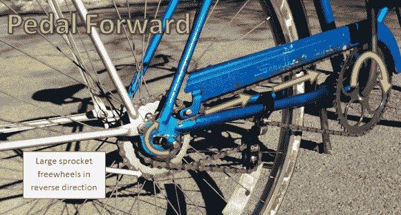

# 双向自行车踏板，带你去目的地，然后回来

> 原文：<https://hackaday.com/2014/04/05/bike-pedals-in-both-directions-gets-you-to-your-destination-and-back/>

[puna men 2]制造了一辆有趣的[自行车](http://imgur.com/a/aZrMC/layout/blog) [，无论是向前还是向后踩都可以向前移动](http://imgur.com/a/aZrMC/layout/blog)！什么？是的，你没看错。向前或向后踩踏板，自行车就会向前行驶。这个项目开始时，任何旧的巡洋舰与飞轮后轮毂。为了实现这一模式，第二个自由轮和链轮必须添加到当前的车轮组件。一组飞轮和链轮用于向前踩踏板，另一组用于向后踩踏板。还有一种新的链条张紧器，它不仅可以保持链条张紧，还可以让链条改变方向，最终使这种新颖的想法得以实现。

迷茫？它是这样工作的:

当向前踩踏板时，自行车就像普通自行车一样，曲柄链轮的顶部拉动链条，然后链条拉动大车轮链轮的顶部。这使后轮向前转动。链条缠绕在小链轮上的部分是向后(逆时针)运动的，这不会造成问题，因为它是一个飞轮，就像你可以在向前滑行的同时向后踩自行车一样。由于有两个不同尺寸的链轮，向前踩踏板是两个齿轮中较高的一个。

当向后踩踏板时，链条向相反的方向运动。曲柄链轮的底部向前拉动链条，链条又拉动小链轮的顶部。这也使后轮向前转动。链条缠绕在大链轮上的部分现在反向(逆时针)运动，因为它是自由转动的，所以也不会引起问题。

【普那门 2】为什么决定这么做？只是为了好玩！在我们的书中，这是一个足够好的理由。

[https://www.youtube.com/embed/kCs_fAilDZI?version=3&rel=1&showsearch=0&showinfo=1&iv_load_policy=1&fs=1&hl=en-US&autohide=2&wmode=transparent](https://www.youtube.com/embed/kCs_fAilDZI?version=3&rel=1&showsearch=0&showinfo=1&iv_load_policy=1&fs=1&hl=en-US&autohide=2&wmode=transparent)

[via [reddit](//www.reddit.com/r/DIY/comments/21u0gt/i_made_a_bicycle_that_you_pedal_in_reverse_cross/)