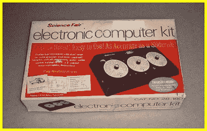
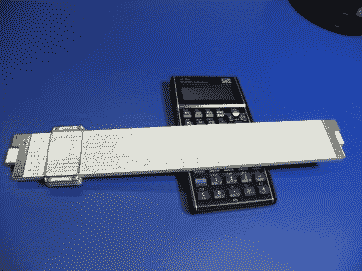
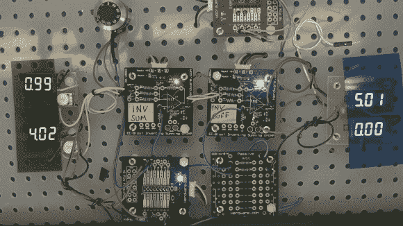
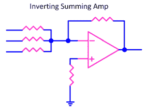
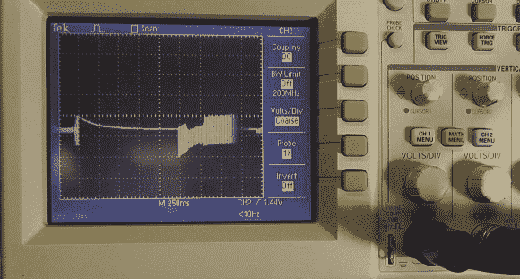

# 比尔·赫德:模拟计算

> 原文：<https://hackaday.com/2014/07/25/bil-herd-computing-with-analog/>

当我年轻的时候，我拥有的第一台“电脑”是一台由套件组装而成的模拟电脑。它有一个倾斜的塑料外壳，外壳上有三个旋钮，旋钮周围有很大的数字刻度，还有一个很小的中心零点测量仪。要操作它，我会根据刻度指示拨入两个数字，然后通过旋转第三个刻度盘调整“答案”，直到小仪表居中。在它下面有一小撮连接在端子板上的元件，包括两三个晶体管。

[https://www.youtube.com/embed/1EHjaBjRvgQ?version=3&rel=1&showsearch=0&showinfo=1&iv_load_policy=1&fs=1&hl=en-US&autohide=2&wmode=transparent](https://www.youtube.com/embed/1EHjaBjRvgQ?version=3&rel=1&showsearch=0&showinfo=1&iv_load_policy=1&fs=1&hl=en-US&autohide=2&wmode=transparent)

回想 20 世纪 70 年代早期的那件遗物，有一段时间我认为他们可能将晶体管用作对数放大器，这意味着它能够进行电子倍增。经过几分钟的思考，我得出结论，这可能更简单，很可能是一个惠斯通电桥。这并不意味着它不能倍增，可能是印刷的刻度是对数的，很像计算尺。

  Science Fair Analog Computer  Old meets new: Analog and digital computation

刚才有人问计算尺是什么吗？让我为 50 岁以下的人进一步解释一下。如果你看关于阿波罗太空计划的录像或电影，你不会看到任何人带着手提计算器，他们还不存在。然而，任务控制中心第一排的导航人员被恰当地称为“战壕”，他们可以快速计算出一个位置或向量，精确到小数点后几位，他们使用的是印有数字的滑动竹片或铝片。

我从我父亲那里继承了我的第一把计算尺，他在大学时用过。那把计算尺上有 32 或 33 个刻度，每个刻度都是不同的数学计算，并且是用竹子制成的，我爸爸指出，在冬天，用铝制计算尺的人会更困难，因为寒冷会使他们卡住。我在 10 年级的化学课上使用计算尺，到了 12 年级，每个人都有了“四个香肠”计算器。当你打开报纸时，你会看到计算器的广告，因为它们很快从 100-400 美元降到 29 美元。

Old meets new: Analog and digital computation

跳到今天，我正坐在一块试验板前，上面有几个模拟运算放大器模块和几个小电压表。运算放大器的 DC 放大有三种基本形式:反相、同相和差分，取决于您注入信号的输入。在差分的情况下，信号被注入到两个输入端。

Inverting Summing Amplifier

很容易看出如何将两个电压相加，我甚至将公式打印在自己的 PCB 上以帮助记忆，但决定性因素是将有一个由电阻构成的分压器连接到一个或多个输入。简而言之，将一部分信号反馈回反相输入端的电路，其增益由该比例决定。

我们很快厌倦了加法和减法，于是开始学习乘法。使用 ADI 公司久负盛名的四象限乘法器 AD633，很容易看出乘法运算的效果，将相同的电压连接到两个输入端会得到平方/平方根。AD633 之所以如此有用，是因为它在利用内部对数特性方面设计得有些精确，并且包含增益，因此曲线的小可用区域变成了更大的可用区域，大到足以在我的三位数电压显示器上看到。

Bil Herd with a multiplier breadboard showing the AD633

最后我们把乘法带回 AC，这才是乐趣所在；在一端注入一个信号音，在另一端注入一个控制电压，我们重新创建了一个电压控制增益模块，就像模拟频率合成器或自动增益控制(AGC)系统的一部分一样。这是调幅的核心，用于收音机和复杂音频合成，如 20 世纪 70 年代合成器中的环形调制器。

Waveform of a control signal multiplied times an audio signal.

AD633 在 DC 和交流信号相乘方面表现出色。基本上，它利用二极管/晶体管结的固有对数特性，但也被精心调整的器件(激光调整电阻)包围，并内置放大器，以充分利用所需的对数响应。

科学展电脑照片由[未来机器人](http://www.futurebots.com/ "Futurebots")的【丹·马蒂亚斯】提供