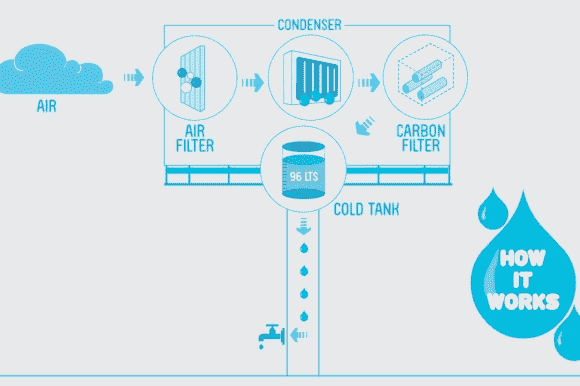

# 广告牌为工程学校做广告，制造饮用水

> 原文：<https://hackaday.com/2014/03/13/billboard-advertises-engineering-school-manufactures-potable-water/>

广告公司在广告过程中设法帮助人们，这是一件了不起的事情。秘鲁技术与工程大学(UTEC)正在寻找提高入学率的方法。他们去了 DraftFCB 机构的秘鲁办事处，并带着安装 [广告牌的想法，这种广告牌可以将利马被水饱和的沿海沙漠空气转化为饮用水](http://www.reshareable.tv/never-thought-a-billboard-could-be-used-this-way.html?h=1) 。

也许唯一的缺点是它需要电力，而且不仅仅是为了那些凉爽的霓虹灯水滴。有五个发生器来捕捉湿度，并使用反渗透来净化水。每个单元都有一个容量为 20 升的水箱。从那里，干净的水聚集在一个主水箱中，并可以从广告牌底部的水龙头收集。仅在三个月内，该广告牌就为人们生产了超过 9000 升(2500 加仑)的饮用水，否则他们将从井中抽取污染的水。

我们喜欢看到有帮助的方法。把你的力量用在好的方面，比如重新利用潮湿的空气和 [污染](http://hackaday.com/2014/03/05/heres-the-dirt-on-printing-with-pollution/) 。让我们来看一个简短的视频和一个艺术家对广告牌内部的构想。

[https://www.youtube.com/embed/FWwii1dX4v8?version=3&rel=1&showsearch=0&showinfo=1&iv_load_policy=1&fs=1&hl=en-US&autohide=2&wmode=transparent](https://www.youtube.com/embed/FWwii1dX4v8?version=3&rel=1&showsearch=0&showinfo=1&iv_load_policy=1&fs=1&hl=en-US&autohide=2&wmode=transparent)

[谢谢迈克]

[图片来源:[时间](http://techland.time.com/2013/03/05/finally-a-billboard-that-creates-drinkable-water-out-of-thin-air/)