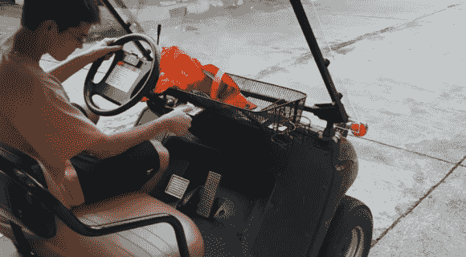

# 生物识别安全高尔夫球车允许无钥匙启动

> 原文：<https://hackaday.com/2014/08/20/biometric-secured-golfcart-allows-for-keyless-start/>

这年头谁还用钥匙，真的？推出世界首创(？生物识别安全高尔夫球车。赋予“一键启动”全新的含义！

[Ramicaza]住在一个小社区里，很多家庭(包括他的！)使用高尔夫球车进行短途通勤，比如去杂货店或学校。厌倦了在父母和兄弟姐妹之间分享钥匙，[Ramicaza]决定用指纹传感器增加他的车，允许无钥匙启动。

他用的是来自 SparkFun 的 ATtiny85 和 GT511-C1 指纹传感器。在试验板上组装好一个电路并测试了这个概念后，他径直走向一个 PCB 原型，准备安装在手推车上。我们真正喜欢的是他集成到高尔夫球车仪表板的情况。它有一个翻盖，打开时可以打开电路，关闭时可以关闭电路以节省电池。扫描你的手指，继电器触发点火装置，让你开车离开。

如果你对制作自己的指纹控制的东西感兴趣，[Ramicaza]也在 [GitHub](https://gist.github.com/ramicaza/c1fafa49951767e7a31c) 上分享了他的源代码。

[https://www.youtube.com/embed/zxbrSZDKxW4?version=3&rel=1&showsearch=0&showinfo=1&iv_load_policy=1&fs=1&hl=en-US&autohide=2&wmode=transparent](https://www.youtube.com/embed/zxbrSZDKxW4?version=3&rel=1&showsearch=0&showinfo=1&iv_load_policy=1&fs=1&hl=en-US&autohide=2&wmode=transparent)

哦，别担心——原来的钥匙还能用。接下来，[指纹安全车库门？](http://hackaday.com/2014/06/25/fingerprint-scanner-both-simplifies-and-complicates-opening-garage-door/)