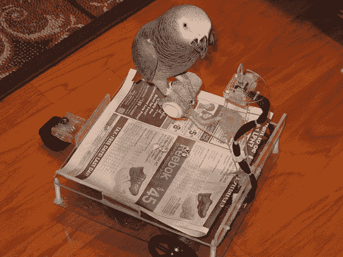

# 鸟笼车安抚尖叫的鹦鹉

> 原文：<https://hackaday.com/2012/12/08/bird-buggy-soothes-a-screeching-parrot/>

十多年来,[安德鲁]一直喜欢和鹦鹉[佩珀]在一起，但是隔壁房间里一只鸟的尖叫声是你不习惯的。[Pepper]有时会变得非常孤独，除非有人把它扛在肩上，否则没有什么能让这只鹦鹉安静下来。[Andrew]有一个想法，让[Pepper]在移动平台的帮助下在房子里四处走动。就这样诞生了鸟车，一种专为[Pepper]制造的鹦鹉控制的交通工具。

该车本身是一个基本的两轮驱动平台，由一个小喙兼容操纵杆驱动，安装在[Pepper]的栖木前方。有了这个系统,[Pepper]就可以跟着[Andrew]在屋子里走来走去。[Andrew]想确保[Pepper]不会撞到墙壁或桌脚，所以前面的一组传感器会在检测到物体时停止童车。

鸟车的一个非常酷的功能是它能够自己开车到充电站。它在网络摄像头和 OpenCV 以及充电端口后面的一对标记的帮助下做到了这一点[。当童车上的 Beagleboard 看到充电端口的绿色和黄色标记对齐时，它知道它就在充电端口的正前方。](https://sites.google.com/site/birdbuggy109/project-overview)

你可以看到[Pepper]在休息后驾驶着他的新鞭子，以及一个非常酷的鸟车与其充电端口对接的演示。

[https://www.youtube.com/embed/rO2TR_8jXPc?version=3&rel=1&showsearch=0&showinfo=1&iv_load_policy=1&fs=1&hl=en-US&autohide=2&wmode=transparent](https://www.youtube.com/embed/rO2TR_8jXPc?version=3&rel=1&showsearch=0&showinfo=1&iv_load_policy=1&fs=1&hl=en-US&autohide=2&wmode=transparent) [https://www.youtube.com/embed/51VtK8xuerY?version=3&rel=1&showsearch=0&showinfo=1&iv_load_policy=1&fs=1&hl=en-US&autohide=2&wmode=transparent](https://www.youtube.com/embed/51VtK8xuerY?version=3&rel=1&showsearch=0&showinfo=1&iv_load_policy=1&fs=1&hl=en-US&autohide=2&wmode=transparent) [https://www.youtube.com/embed/vgZ8k-hOnfY?version=3&rel=1&showsearch=0&showinfo=1&iv_load_policy=1&fs=1&hl=en-US&autohide=2&wmode=transparent](https://www.youtube.com/embed/vgZ8k-hOnfY?version=3&rel=1&showsearch=0&showinfo=1&iv_load_policy=1&fs=1&hl=en-US&autohide=2&wmode=transparent)