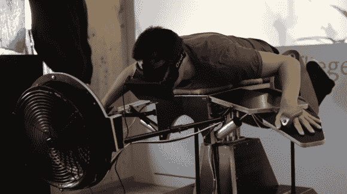

# Birdly，虚拟现实模拟器保证让你筋疲力尽

> 原文：<https://hackaday.com/2014/06/17/birdly-the-virtual-reality-simulator-guaranteed-to-wear-you-out/>

你曾经梦想过能像鸟一样飞翔吗？可悲的是，我们的固体骨骼和脂肪组织太重了——但现在有一种叫做 Birdly 的模拟器可以给你渴望的体验！

由[Max Rheiner]、[杨奇煜·特克斯勒]、[托马斯·托布勒]和[托马斯·埃尔丁]组成的瑞士团队想要建造一个以前从未做过的模拟器——一个模拟拍打翅膀并实际飞行的模拟器。他们正在使用 Oculus Rift 来完成视觉体验，以及一种非常独特的模拟椅，你可以面朝下躺在上面。它有两个机械翅膀，你可以将手绑在上面，气弹簧提供阻力——传感器测量你“拍动”的行程和力量，将信息传递给计算机，以控制你的虚拟翅膀。你也可以向任何方向倾斜，可以玩花式鸟类杂技。

直接安装在前面的大型风扇有助于使体验更加真实，因为你在虚拟世界中飞行。他们说，它还包括嗅觉反馈，向你呈现不同的气味，代表你在虚拟世界中的位置——我们不太清楚这是如何工作的，但听起来很棒！

[https://player.vimeo.com/video/91069214](https://player.vimeo.com/video/91069214)

[via [Reddit](http://www.reddit.com/r/gaming/comments/287fhj/bird_simulator/)