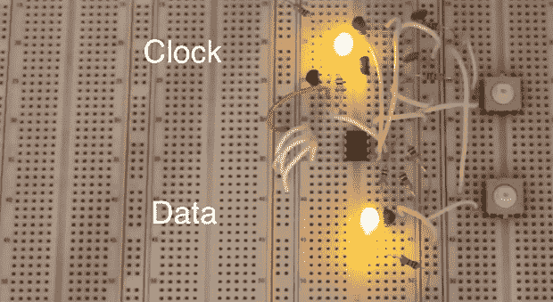

# 用手敲打 I2C

> 原文：<https://hackaday.com/2013/08/11/bitbanging-i2c-by-hand/>

玩电子产品玩久了，最终你会碰到 I2C 设备。这些芯片——从传感器、存储器到 DAC 和 ADCs 使用仅由两条线组成的标准化接口。与这些设备的交互通常是通过一个微控制器和一个 I2C 库来完成的，但是[Kevin]想要更进一步。他用手敲打 I2C 的设备，并在这个过程中接受了很好的 I2C 协议教育。

每个 I2C 设备都由微控制器的两条连接控制，一条数据线和一条时钟线。[Kevin]通过一对晶体管将这些线连接到轻触开关，允许他手动键入 I2C 命令，一次一位。

[Kevin]正在使用 24LC256 EEPROM 进行演示，通过输入一个控制字节和两个地址字节，他可以手动输入一个字节的数据，这些数据将在这个小小的芯片中保存很多很多年。

当然，将数据存入芯片只是问题的一半。通过将 I2C 信息开头的控制字节改变一位，[凯文]也能从芯片中读出数据。

这不是[凯文]第一次用按钮控制芯片的实验。早些时候，我们看到他用五个按钮摆弄一个 595 移位寄存器。这是直观了解这些芯片实际工作原理的一个很好的方法，对于年轻和年老的修补者来说是一个极好的学习练习，

[https://www.youtube.com/embed/8ZYMrcHm91s?version=3&rel=1&showsearch=0&showinfo=1&iv_load_policy=1&fs=1&hl=en-US&autohide=2&wmode=transparent](https://www.youtube.com/embed/8ZYMrcHm91s?version=3&rel=1&showsearch=0&showinfo=1&iv_load_policy=1&fs=1&hl=en-US&autohide=2&wmode=transparent)