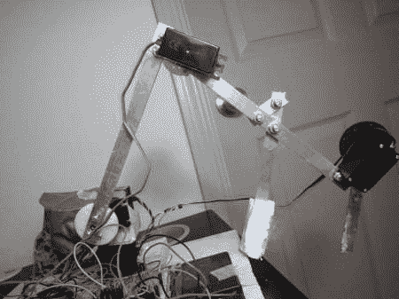

# 零零碎碎的机械臂

> 原文：<https://hackaday.com/2012/09/10/bits-and-peices-robotic-arm/>

17 岁的[V0R73X]一直在做一个项目，建造一个机器人手臂。这个项目最初是他的一位学校老师提出的一个挑战，花 200 美元建造一个机器人手臂。[VoR73X]接受，挑战开始。

他发明了一种可以通过手机和其他蓝牙设备控制的机械臂。他还设计了它，这样他就可以用旧电视机的红外遥控器来控制它。[VoR73X]决定保持简单的设计，以便于其他人构建。[VoR73X]分享了代码和如何构建的逐步过程，希望其他人也愿意接受挑战。休息后观看视频，了解他的项目的更多细节。

via[[指令表](http://www.instructables.com/id/Intro-48/)

[https://www.youtube.com/embed/tE-gb2O_4KI?version=3&rel=1&showsearch=0&showinfo=1&iv_load_policy=1&fs=1&hl=en-US&autohide=2&wmode=transparent](https://www.youtube.com/embed/tE-gb2O_4KI?version=3&rel=1&showsearch=0&showinfo=1&iv_load_policy=1&fs=1&hl=en-US&autohide=2&wmode=transparent)