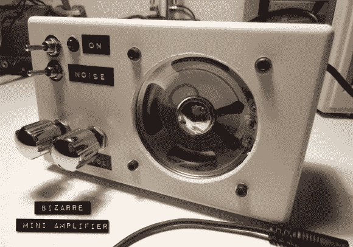

# 诡异的迷你放大器+白噪声发生器？

> 原文：<https://hackaday.com/2013/12/12/bizarre-mini-amplifier-white-noise-generator/>

[Jordi]做了这个看起来很棒的迷你放大器，它有一个相当不寻常的功能。他称之为[奇异的迷你放大器](http://www.tolaemon.com/bizarrema/),因为它还内置了一个白噪声发生器！奇怪吧？

现在，大多数人只会找到一个合适的放大器，并把它放在一个漂亮的盒子里，但不是[乔迪]！他从头开始设计了放大器电路！像大多数典型放大器一样，它有四个不同的级:

1.  阻抗适配级:左右声道均有两个运算放大器，高输入阻抗允许连接不同的音频源，而不会影响输出。
2.  混频器级:使用第三个运算放大器将左、右和噪声信号合成一个。电位计是允许音量控制的输出电阻。
3.  滤波器级:一个简单的滤波器级，使用一个 R-C 低通滤波器，另一个电位计控制音调。
4.  功率级:提高输出的最终功率放大器。

在建立电路后，有一点故障排除使其正常工作，所以如果你感兴趣[Jordi]在他的博客上写了一篇很好的文章。

最后，他发现有助于睡眠后，决定添加一个白噪声发生器。这是项目中他没有详细说明的一部分！但是，考虑到这只是白噪音，我们可能会弄清楚他做了什么。休息后留下来看看设备的运行情况！

[https://www.youtube.com/embed/BwOBgmBc6f0?version=3&rel=1&showsearch=0&showinfo=1&iv_load_policy=1&fs=1&hl=en-US&autohide=2&wmode=transparent](https://www.youtube.com/embed/BwOBgmBc6f0?version=3&rel=1&showsearch=0&showinfo=1&iv_load_policy=1&fs=1&hl=en-US&autohide=2&wmode=transparent)

我们喜欢这种复古风格的东西。我们知道它只是一个普通的旧白色项目箱，但在清晰的扬声器、chrome 开关和旧标签之间，它看起来就是…太棒了！