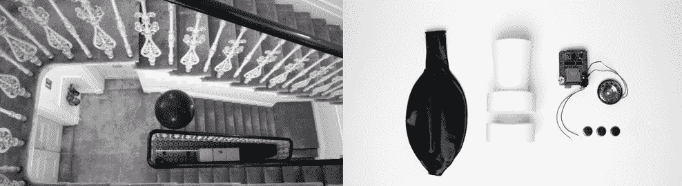

# 黑球只是想找个人说说话

> 原文：<https://hackaday.com/2014/03/10/black-orb-just-wants-someone-to-talk-with/>

皇家艺术学院的一个团队创造了[太空回放](http://ied.rca.ac.uk/de-computation/space-replay)，一个漂浮的黑色球体，记录并回放路人的对话。Space Replay 是一个携带小型有效载荷的中性浮力氦气球。一个 Arduino，一个 Adafruit 波盾和一个小扬声器组成了气球的大脑。该团队使用 [waverp](https://code.google.com/p/waverp/) 图书馆通过他们的盾牌记录和回放声音。3 个锂硬币电池为系统供电。一个小的真空成型塑料外壳将所有内部部件保持在一起，并作为一个小的扬声器锥体来放大进出球体的声音。

如视频所示，最后的结果相当令人毛骨悚然。地铁站里的一阵微风使球体沿着走廊慢慢移动。有人会认为太空回放会吓到一些人，或者至少会吸引好奇的人去触摸它。除了一个被逗乐的电梯乘客，镇定的伦敦公众对此毫不在意。也许如果它有一些茶…

[https://player.vimeo.com/video/87979136](https://player.vimeo.com/video/87979136)