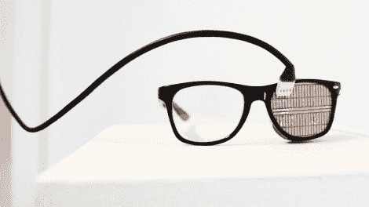

# 闪烁灯开关

> 原文：<https://hackaday.com/2012/08/11/blinking-light-switch/>

除了是老化眼罩的绝佳替代品外，[这些眼镜还能充当电灯开关](http://www.fastcodesign.com/1670409/glasses-that-turn-off-the-lights-every-time-you-blink)。通过观察你的眼睑，它们能够在你眨眼的时候熄灭灯光。

这个装置是一个由[Michal Kohút]构思的共享体验作品。他想说明我们都经常眨眼，但却很少思考。该系统使用 Arduino 来捕捉来自闪烁传感器的事件，并相应地切换灯光。这样，佩戴者不会感觉失去照明，但观察者会感觉到。休息之后，请观看视频进行快速演示。

来自源文章的[的一位评论者向](http://www.creativeapplications.net/environment/0-1-blink-and-the-lights-go-out-light-installation-by-michal-kohut/)[分享了另一个基于眨眼的光项目](https://vimeo.com/40469251)的视频链接。这种仪器使用附着在眼睛周围皮肤上的电极来检测眼睑的运动。

[https://player.vimeo.com/video/45921590](https://player.vimeo.com/video/45921590)

[via [Reddit](http://www.reddit.com/r/gadgets/comments/xuex9/glasses_that_turn_off_the_lights_every_time_you/)