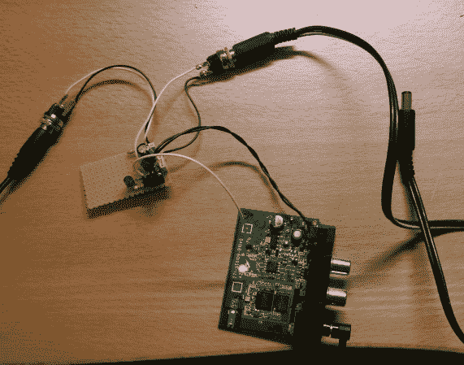

# 蓝牙音频适配器被黑，以关闭扩音扬声器

> 原文：<https://hackaday.com/2013/11/11/bluetooth-audio-adapter-hacked-to-switch-off-amplified-speakers/>

这款蓝牙音频适配器旨在通过普通的老式线路输入连接将蓝牙音频源(如智能手机或平板电脑)连接到扬声器系统。当蓝牙设备进入通信范围时，它能够自动连接。听起来很方便，直到[Andreas psch]指出他仍然需要手动打开和关闭扬声器。这个黑客[使用一点额外的硬件自动化了整个事情](http://mechaos.de/wordpress/?p=344)。

如果你仔细看，你会看到黑色电缆有桶插孔。这是他发明的能量传递装置。原型板包括一个 7805 线性稳压器，它代替原来的电源适配器向绿色电路板供电。一个 MOSFET 开关流向扬声器的输出电源。所有这些都可以放入原来的机箱中，他只需添加一个交流适配器端口。

这绝对是古董收音机翻新的绝佳选择。这些适配器中的一个只需 30 多美元就可以买到！