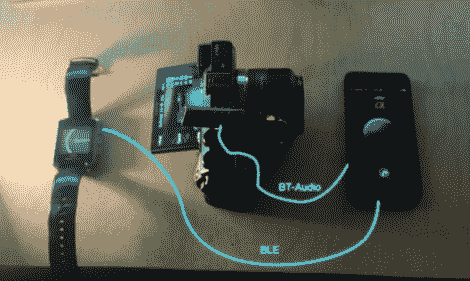

# 蓝牙控制你的 DSLR 或任何其他红外操作设备

> 原文：<https://hackaday.com/2012/10/30/bluetooth-control-for-your-dslr-or-just-about-any-other-ir-operated-device/>

就在几天前，我们在 Reddit 上看到一个帖子，询问如何用智能手机控制电视。对话从谈论给手机添加红外 LED 开始。然后有人建议应该有独立的蓝牙设备将命令转换成红外信号，并提出了电视应该自带蓝牙硬件的想法。我们完全同意，但我们也不会因为这个选项而更换电视。这就是为什么我们很高兴地发现这个项目正在等待我们的提示。这是一种使用蓝牙从智能手机控制相机快门的方法。但是这项技术适用于任何使用红外遥控器的设备。

休息后的视频显示了两个不同的设备控制相机快门。如上图所示，iPhone 是主控制器，连接到安装在相机上的蓝牙耳机。这款耳机被改装成将扬声器连接到指向相机接收器的红外 LED 上。iPhone 会播放与 IR remote 命令匹配的编码音轨，导致 LED 上闪烁格式正确的信息。这款手表没有播放音频的功能，但它可以向手机发送信息，然后通过耳机播放正确的音轨。

[https://player.vimeo.com/video/52308436](https://player.vimeo.com/video/52308436)