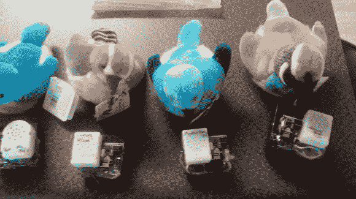

# 一群鸟中的蓝牙低能量信标

> 原文：<https://hackaday.com/2014/08/15/bluetooth-low-energy-beacons-in-a-flock-of-birds/>

不，不是真的鸟！[Kyle]在一家网络公司工作，他需要一种向同事发送警报的方式，所以他改造了一群奥杜邦协会的长毛绒鸟来响应蓝牙信标。

使用 NRF24L01+蓝牙低能耗模块，[Kyle]在这些电池供电的唱歌鸟中各安装了一个。这些设备可能是由鸟类自带的电池供电的，但 BTLE 模块的使用意味着电池不会很快放电。

[Kyle]还构建了一个通过 HTTP 或 IRC 工作的 API，这意味着办公室的员工可以通过一个简单直观的界面激活其他人的鸟。这些鸟可以一次激活一只，或者作为一个大群体一起处于“恐慌”模式(以防办公室出现紧急情况)。它们也可以在特定的时间一次激活一个，以模拟奥杜邦协会的鸟叫时钟。

他称这种设备为 equail，这是一种非常独特的通知系统，有很多应用。[Kyle]项目的所有代码和文档都可以在他的 github 站点上找到。他还使用了[这本关于 BTLE](http://hackaday.com/2013/08/29/primer-on-bluetooth-low-energy/) 的入门书作为开始，[这本关于通过 BTLE](http://hackaday.com/2013/09/21/sending-data-over-bluetooth-low-energy-with-a-cheap-nrf24l01-module/) 发送数据的指南来帮助启动这个项目。