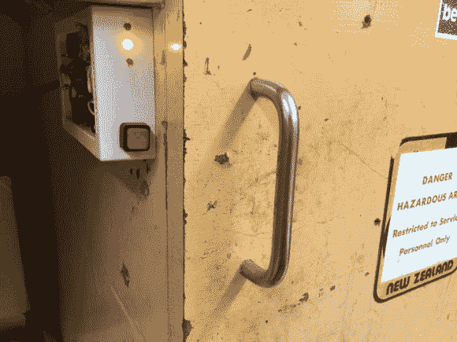

# 蓝牙安全和电容感应工具柜手柄

> 原文：<https://hackaday.com/2014/06/25/bluetooth-security-and-capacitive-sensing-tool-cabinet-handles/>

[Andy]需要为工作中的工具柜配一套新锁，但不想随身携带另一把钥匙(或记住密码！)他决定把[这个小黑客组合在一起](http://handya.co.nz/post/89734624902/bluetooth-enabled-tool-cupboards)——螺线管锁定、电容感应、工具柜门把手。

为此，他使用了一个蓝牙低能耗分线板，配有一个 Arduino、两个螺线管锁和两个电容传感器。他修改了一个预先存在的 iPhone 应用程序来控制系统，被称为:BlueLock Control。

当[安迪]拿着他的手机出现时，系统可以被激活，允许在你触摸金属手柄的那一刻自动解锁。通常他在工作日的大部分时间都不锁门，但一天结束后，他只需简单地在手机上滑动一下，就可以在晚上进入锁定模式。为了以防万一，他还为两个螺线管添加了手动按钮，以防电容传感器出现任何问题。酷黑[安迪！]

既然你这么做了，为什么不用蓝牙为你的汽车制作一个无钥匙进入系统呢？