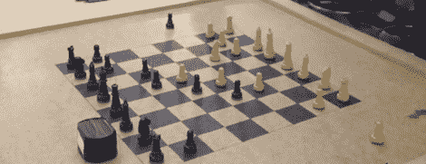

# IP 上的棋盘游戏意味着网真象棋

> 原文：<https://hackaday.com/2012/04/04/board-games-over-ip-means-telepresence-chess/>

通信象棋，或通过电子邮件或蜗牛邮件下一盘棋，在象棋界是众所周知的。[FunGowRightNow]认为他可以将通信象棋带入 21 世纪，所以他[建造了两个通过互联网通信的机器人象棋棋盘](http://www.youtube.com/watch?v=dX37LFv8jWY)。最终结果是一个令人敬畏的学校高年级项目。

不是简单的显示器显示其他玩家的移动(并且必须手动移动黑色和白色的棋子)，所有棋子的位置都通过~~一台笔记本电脑~~每个棋盘下面的 Arduino 来控制。安装在 xy 框架上的电磁铁一次移动一块。为了检测棋子的位置，一个 [8×8 网格的簧片开关](http://i.imgur.com/KZ89E.png)打开和关闭，磁铁放在每个棋子的底部。最终的结果是一个几乎无缝的国际象棋游戏，可以由相隔数百英里的两个人来玩。

现在，我们只有一些视频和对棋盘内部阴谋的描述。[FunGow]承诺在他于 4 月 10 日将此作为他的毕业设计上交后，将提供互联网设计规范。在那之前，你可以欣赏他在休息后发布的一些视频。

via [reddit](http://www.reddit.com/r/electronics/comments/rpdl4/my_senior_project_wireless_arduino_powered_chess/)

[https://www.youtube.com/embed/dX37LFv8jWY?version=3&rel=1&showsearch=0&showinfo=1&iv_load_policy=1&fs=1&hl=en-US&autohide=2&wmode=transparent](https://www.youtube.com/embed/dX37LFv8jWY?version=3&rel=1&showsearch=0&showinfo=1&iv_load_policy=1&fs=1&hl=en-US&autohide=2&wmode=transparent) [https://www.youtube.com/embed/EIFnSxEvxBM?version=3&rel=1&showsearch=0&showinfo=1&iv_load_policy=1&fs=1&hl=en-US&autohide=2&wmode=transparent](https://www.youtube.com/embed/EIFnSxEvxBM?version=3&rel=1&showsearch=0&showinfo=1&iv_load_policy=1&fs=1&hl=en-US&autohide=2&wmode=transparent) [https://www.youtube.com/embed/XCp4M08IWnA?version=3&rel=1&showsearch=0&showinfo=1&iv_load_policy=1&fs=1&hl=en-US&autohide=2&wmode=transparent](https://www.youtube.com/embed/XCp4M08IWnA?version=3&rel=1&showsearch=0&showinfo=1&iv_load_policy=1&fs=1&hl=en-US&autohide=2&wmode=transparent)