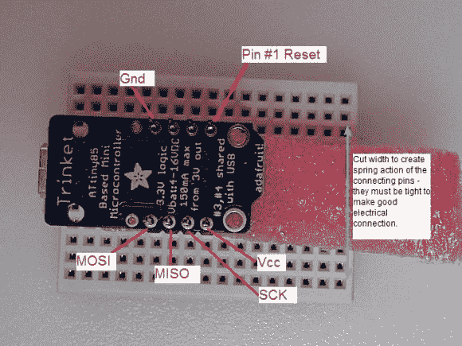

# 小饰品的身体，数码火花的灵魂

> 原文：<https://hackaday.com/2014/01/22/body-of-a-trinket-soul-of-a-digispark/>

Adafruit 的小饰品和 digiStump 的 Digispark 板是相当接近的表亲。两者都使用 ATtiny85 微控制器，都具有 USB 功能，并且都与 Arduino IDE 配合良好。[雷]是两种板的爱好者，但他更喜欢小饰品。他也更喜欢 Digispark 库和生态系统。因此，他做了唯一合乎逻辑的事情:[他把他的小饰品变成了数码火花](http://www.hackster.io/rayburne/trinket-firmware-exorcism)。第一步是去掉那个讨厌的复位按钮。Trinket 使用引脚 1/PB5 进行复位，而 Digispark 将其保留为 I/O 引脚。[Ray]拆除了重置按钮，但选择将其金属外壳留在板上。

下一步是事情变得有点危险的地方:用 Digispark 固件和保险丝闪烁饰品。[雷]很快注意到，一旦闪到 Digispark 固件，小饰品不能恢复自己的股票。将需要一个高压编程器(又名设备编程器)。刷新过程本身比标准的饰品固件刷新要简单得多。[Ray]使用来自[微核](https://github.com/micronucleus)项目的固件上传工具。微核有一个 60 秒的轮询周期，任何一个饰品老手都会告诉你这是一件很棒的事情。不要再按按钮，希望你在一切超时前开始下载！一旦小饰品运行 Digispark 固件，它现在就可以使用一套全新的库和软件。