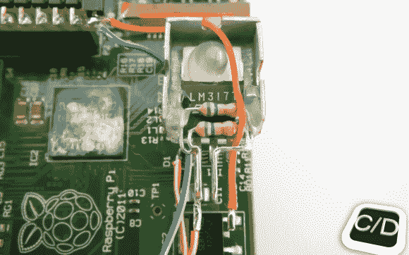

# 用电流调节器支持 Raspberry Pi HDMI

> 原文：<https://hackaday.com/2013/07/06/bolstering-raspberry-pi-hdmi-with-a-current-regulator/>

我们从未尝试使用 HDMI 到 VGA 转换器和 Raspberry Pi。我们听说他们很贵，而且总是只使用 HDMI 输出(尽管 DVI 也一样简单)。显然，如果你有一个 VGA 转换器没有供电，RPi 板可能会由于连接器电流不足而输出不稳定的视频。[Orlando Cosimo]向[展示了如何用一些便宜的组件解决问题](http://creativityslashdesign.blogspot.it/2013/06/hdmi-current-booster-for-raspberrypi-by.html)。

就在今天早上，我们看到了使用 LM317 的便携式 PSU。这个项目使用相同的部分，但以不同的方式。[Orlando]使用三个并联的电阻，使 LM317 的行为像一个电流调节器(而不是电压调节器)，它将输出约 550 毫安。输入电压直接来自 microUSB 端口的 5V 线路。输出注入 HDMI 连接器。这将增加无动力 VGA 转换器可用的果汁量，稳定系统。

RPi 还有很多其他的权力黑客。我们最喜欢的方法之一是用开关模式调节器代替股票线性调节器[。](http://hackaday.com/2012/06/30/raspberry-pi-power-regulator-transplant-reduces-power-consumption/)

[via [危险原型](http://dangerousprototypes.com/2013/06/26/hdmi-current-booster-fixes-raspberry-pi-video-instability/)