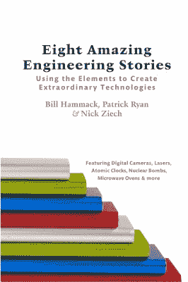

# 书评:八个惊人的工程故事

> 原文：<https://hackaday.com/2012/07/06/book-review-eight-amazing-engineering-stories/>

我们是工程师比尔·哈马克的超级粉丝。他的一系列工程视频勾起了观看《巫师先生》的愉快回忆，但却吸引了成年科学爱好者。最近的一季(他称之为系列#4)触及了他的书*中涵盖的主题，这本书是与合著者【Patrick Ryan】和【Nick Ziech】共同撰写的。他们向我们提供了这本书的免费电子版，以供此次评论使用。*

 *视频中的对话风格完美地诠释了这本书，但就像将一部小说比作一部电影一样，书面文字允许有更多的深度。例如，我们喜欢了解[苹果公司如何使用阳极氧化法对用于 iPod 外壳的铝进行染色](http://hackaday.com/2012/05/29/how-anodization-is-used-to-make-pretty-ipod-colors/)。相同的演示风格使得这个话题对于任何在高中学过化学和数学的人来说都很容易理解。但是 primers a 侧边栏提供了一个可选的镜子之旅，解释了这一过程背后的历史，它与自然材料的比较，以及在选择这一过程中做出的权衡。

其他主题包括 CCD 相机传感器、铅酸电池、mems 加速度计和原子钟的工作原理。随着这本书的进展，通过所有八个主题的一般概念，正在解释的项目的复杂性进展很快。到了第七个故事——它涵盖了微波炉中的 magentron 我们打赌这些概念挑战了大多数读者的认知。但是我们仍然喜欢每一页。这本书会成为泳池边的绝佳读物。这将是一个很好的毕业礼物(可惜我们错过了一年中的这个时候)，但请记住它，送给任何有科学头脑的朋友或亲戚。你可以在休息后的剪辑中看到[比尔]自己对这本书及其所有格式的描述。

TLDR:买下来或者作为礼物送给别人

[https://player.vimeo.com/video/41909802](https://player.vimeo.com/video/41909802)*