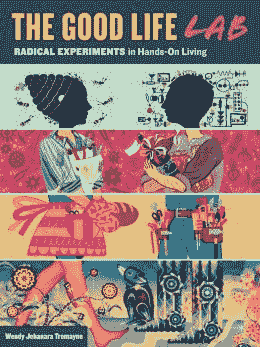

# 书评:美好生活实验室

> 原文：<https://hackaday.com/2013/05/27/book-review-the-good-life-lab/>

停下你正在做的事情，拿起这本书。我刚刚读完这本书，我不得不说[Wendy]和[Mikey]很容易成为现代黑客的典型代表，这本书可以成为建立在黑客基础上的生活指南。

去年我去拜访【温迪】和【米奇】时，我被震撼了。他们的小家园是名副其实的杂烩。我所到之处，东西都被拼凑、修改、修理和改进。他们努力在自己的生活中扮演积极的角色，他们的生活没有一个方面没有得到改善。

我知道这听起来有点俗气。我们都在生活中扮演着积极的角色，对吗？当然可以。但是他们所做的是创造了一个黑客的家园。我的项目倾向于放在我的工作台上，偶尔会干涉我的日常生活，但他们会去几乎什么都没有的地方，把他们找到的所有需要的东西拼凑起来。他们的生活就是他们的工作台。

如果有需要，就会制造某种东西来满足这种需要。他们建造的建筑是用废料和纸建造的，他们使用的电力来自他们自己拼凑的太阳能系统和电池阵列，他们吃的食物是使用智能规划从沙漠中培育的。这不仅令人印象深刻地展示了黑客的独创性，而且鼓舞人心。

这本书基本上分为两部分。

第一部分。故事:

[温迪]和[米奇]是纽约的黑客。你可能会从他几年前为 hackaday 写的一些文章中想起[Mikey]，以及出现在我们页面上的[他的项目](http://hackaday.com/page/2/?s=sklar)。【温迪】开始 [swap-o-rama](http://www.swaporamarama.org/) ，你可能也看过。这本书的这一部分是对同时挣扎着以两种不同方式生活的黑客的有趣看法(DIY/Hacking vs .获得一份工作并成为正常人)。最终，他们决定搬到新墨西哥州中部，只生产他们需要的东西。他们也一直在他们的博客[上记录这整个过程。](http://blog.holyscraphotsprings.com/)

我对“黑客坠入爱河”的故事不太感兴趣，我惊喜地发现，这更像是他们在纽约做的一些很酷的事情的第一手资料。有这样的故事，比如[温迪]在纽约街头精心策划了一场涉及装饰性燃烧桶的大型活动，或者[米奇]在火人节制作了一堆带遥控的振动内衣，发给陌生人。

第二部分。实验室。

在花了这么多时间做他们所做的事情后，他们汇编了一章又一章的项目来生存。从收集和修理汽车电池这样的电子项目，到种植和收集你自己的药用植物，从旧电话簿到改装汽车使用油脂来建造整个建筑。我认为这部分应该作为课程的一部分在高中分发。

如果你不知道，我喜欢这本书。这几乎就像是瞥见了属于[Niel Stephenson]书中的一个虚构的地方(我可以想象在钻石时代穿过这个地区)。我还应该提到，尽管我去年去过他们那里，但我并不真正了解他们。我知道他们在我的旅途中，给他们发了一封电子邮件。他们是很棒的主人，招待我们，逗我们开心，带我们去格兰德河游泳。