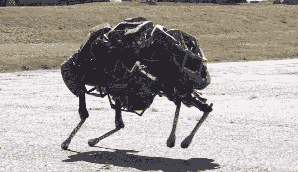

# 波士顿动力把野猫带到外面

> 原文：<https://hackaday.com/2013/10/05/boston-dynamics-takes-wildcat-outside/>

波士顿动力公司发布了他们最新机器人的视频，这意味着在它来抓我们之前，是时候躲在床上了。新视频以野猫为特色，它显然是我们去年看到的[猎豹机器人](http://hackaday.com/2012/09/07/cheetah-robot-can-run-down-even-the-fastest-of-us/)的进化。猎豹是一只室内猫，在跑步机上跑步时被电源、数据和液压线路束缚着。《野猫》已经发行，用来恐吓人们探索大自然

让人想起[大狗](http://hackaday.com/2013/03/29/bigdog-throwing-cinder-blocks/)的早期视频，野猫目前由内燃机驱动。发动机驱动液压系统，然后驱动机器人的腿和前/后吊舱。像这样的系统的好处是切换到电动马达很简单——只需更换内燃机。虽然我们肯定这将使一个更隐形的猫，重量和运行时间可能是问题。将动力系统搬到船上也让野猫慢了一点。猎豹能够达到 28 英里每小时，而野猫只能达到 16 英里每小时。

野猫是 DARPA 最大机动性和操纵计划的一部分。这项研究似乎专注于改善机器人以各种速度移动的步态。视频突出了跳跃和飞奔。慢镜头显示野猫的四条腿都离开了地面，这是经典疾驰步态的暂停阶段。控制还不完美，因为野猫在视频中的某一点摔倒了。不过，它马上就恢复了，并准备好迎接更多挑战。

[https://www.youtube.com/embed/wE3fmFTtP9g?version=3&rel=1&showsearch=0&showinfo=1&iv_load_policy=1&fs=1&hl=en-US&autohide=2&wmode=transparent](https://www.youtube.com/embed/wE3fmFTtP9g?version=3&rel=1&showsearch=0&showinfo=1&iv_load_policy=1&fs=1&hl=en-US&autohide=2&wmode=transparent)