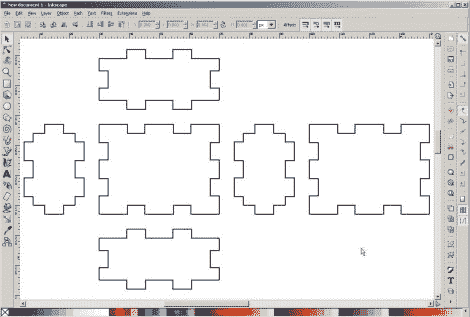

# Inkscape 的制盒机扩展

> 原文：<https://hackaday.com/2012/07/26/box-maker-extension-for-inkscape/>

如果你使用 Inkscape 来设计你的激光切割机，你可能想要[看看这个 box maker 扩展](http://www.keppel.demon.co.uk/111000/111000.html)。Inscape 是 Elliot 的首选绘图软件，因为它简单易用，而且是开源的。在不得不为一个盒子设计标签后，他认为值得努力开发一个工具来自动完成这项工作。该扩展在 Inkscape 内部工作，允许您使用一组自动生成的框边来启动项目。

扩展的输入窗口为关节设计留下了大量选项。除了盒子的尺寸(可以选择内部或外部尺寸)，您还需要输入材料的厚度、切口尺寸(切口的宽度)以及齿间的间隙。齿的宽度也可以配置。

[我们激光切割替换案例的特点](http://hackaday.com/2012/07/26/a-mixer-rebuilt-to-travel/)促使【Elliot】向我们透露他的延期事宜。该项目使用基于 web 的零件生成器进行联合设计。