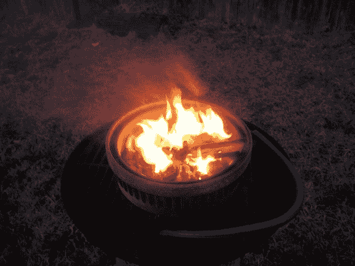

# 制动鼓和管件让你开始锻造

> 原文：<https://hackaday.com/2013/01/24/brake-drum-and-plumbing-parts-get-you-started-with-blacksmithing/>

如果你想做一些严肃的金属加工，你需要一种加热原料的方法。这是一个将[一个制动鼓和一些管道配件组合成一个入门级锻造](http://www.instructables.com/id/Basic-Brake-drum-Forge-for-under-40)的建筑。这是一个相当便宜的开始，看看是否适合你打铁。

[明日香]说这些零件花了他大约 40 美元。制动鼓是从当地的废品站花十块钱买来的。为此，他增加了一个淋浴地漏板，以防止燃料落入空气入口。我们怀疑一旦煤真的燃烧起来，那薄薄的金属屏还能坚持多久，但是谁知道热量会上升到多少呢？在桶的底部，他用一些螺母和螺栓安装了一个管道法兰。镀锌管配件连接到这个注入空气到锻炉。现在他正在用一台压缩机和一些花园软管来煽风点火，但他计划从汽车回收处弄一个风扇来做一个更持久的设置。

初学者注意事项。铁匠工作可能很危险。我们想向您推荐[这个关于伤害的讨论主题](http://www.reddit.com/r/Blacksmith/comments/16l52m/am_i_the_only_one_who_keeps_near_injuries_at_the/)。