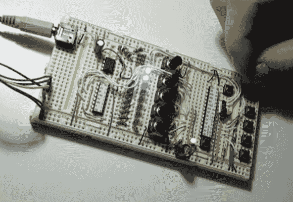
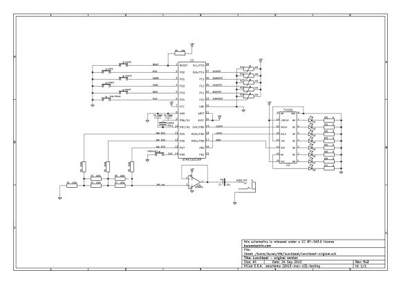

# 试验板序列器用很少的硬件做很多事情

> 原文：<https://hackaday.com/2013/09/26/breadboard-sequencer-does-a-lot-with-very-little-hardware/>

[Jan Cumpelik]用他的试验板序列器从很少的组件中挤出大量的性能，他称之为 Lunchbeat。我们真的很喜欢他的牛逼试验板，它有一系列垂直于长边母线带的沟槽。我们所有的试验板中间只有一个沟槽。这一点，加上他疯狂的试验板技能，导致了一个真正干净的原型。

离他手最近的芯片是驱动序列发生器的 ATmega328。它从那排 10k 微调按钮以及一系列触觉开关接收输入。反馈由一排八个发光二极管提供。这些由 595 移位寄存器驱动，以节省微控制器上的引脚。剩下的芯片是一个运算放大器，它与一个 3 位 R2R 梯形 DAC 一起输出音频。在观看下面的演示之前，请将您的扬声器音量调低一点。在那里你还可以找到我们为了方便你而制作的他的示意图的图像版本。它只在他发布的代码库中以 PDF 格式提供。

[https://www.youtube.com/embed/1SUVzWCnV5Q?version=3&rel=1&showsearch=0&showinfo=1&iv_load_policy=1&fs=1&hl=en-US&autohide=2&wmode=transparent](https://www.youtube.com/embed/1SUVzWCnV5Q?version=3&rel=1&showsearch=0&showinfo=1&iv_load_policy=1&fs=1&hl=en-US&autohide=2&wmode=transparent)

