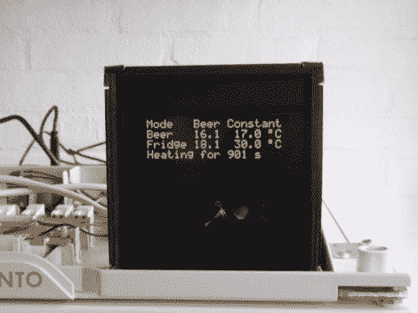

# BrewPi 是负责啤酒发酵的树莓 Pi

> 原文：<https://hackaday.com/2012/10/01/brewpi-is-a-raspberry-pi-in-charge-of-beer-fermentation/>

看看 BrewPi，[一个用树莓 Pi](http://brewpi.com/brewpi-released-all-source-code-online-a-wiki-a-forum-a-bug-tracker-lets-go/) 做的发酵控制器。该项目将对冰箱和灯泡的控制嵌入到树莓派的面板中。RPi 本身带来了网络连接。你最终得到的是一个已经高度可配置的发酵系统，它可以接受更多的功能。

这个系统的幕后黑手是埃尔科·雅各布斯。你可能会从超级冰箱项目中想起他的名字。那是一个基于路由器的发酵控制器。这保持了相同的硬件以及在线绘图和控制功能，如设置温度上升和下降的绘图点。现在也有一个 Arduino 正在使用，它通过从 RPi 接收的 json 包来处理硬件交换。但是现在他已经解决了大部分的错误，抛弃 Arduino 并为此目的构建一个合适的 RPi 屏蔽应该是相当容易的。