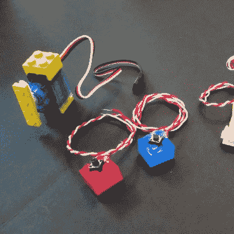

# 乐高“砌砖”微控制器激励年轻程序员

> 原文：<https://hackaday.com/2015/05/19/bricking-microcontrollers-sparks-interest-in-programming/>

回到他大约 7 岁的时候，[Ytai]学会了在 Atari 800XL 上编程。现在他自己也有一个七岁的孩子，他想激发自己对编程的兴趣，所以他创造了这些带有微型嵌入式微控制器的可编程乐高积木。这可能是为数不多的几个“砌砖”微控制器是一件好事！

该项目的核心是 [Espruino Pico](http://www.espruino.com/Pico) 微控制器，它具有在一个非常小的封装中运行 Java 堆栈的有趣特性。[块状 IDE](https://developers.google.com/blockly/) 也非常简单，不会让用户在语法上陷入困境(这可能会让新程序员感到沮丧，尤其是当他们还不到十年的时候)。[Ytai]制造的砖块包括一个伺服电机，机身和手臂上有砖块，一些集成到技术砖块中的 led，以及一些按钮砖块。

我们总是喜欢看到那些旨在让孩子们对创造、编程和黑客感兴趣的项目，而这个项目确实做到了这一点！[Ytai]计划开发更多基于乐高的项目，以帮助他的孩子保持对编程的兴趣，我们期待看到这些！如果你正在寻找其他方式来激发年轻人的好奇心，一定要看看[微型机器人](http://hackaday.com/2014/05/16/introducing-mirobot-a-diy-wifi-robot-for-children/)，或者如果你知道一些青少年需要一些指导，也许这些[战斗机器人](http://hackaday.com/2014/04/04/robot-cage-fighting-is-still-a-thing/)更适合你。