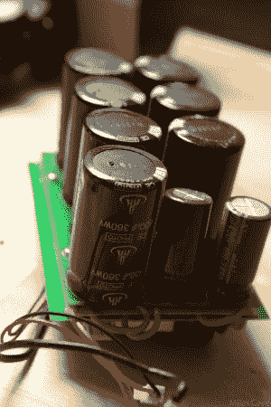

# 用 Studio Strobe Power Hack 点亮你的一天

> 原文：<https://hackaday.com/2014/07/03/brighten-your-day-with-studio-strobe-power-hack/>

[OiD]在易贝买了几个便宜的工作室闪光灯，对电源控制不满意。所以他重新接了线。这些灯就像专业摄影师的超级闪光灯，包含一些非常大的电容器组。他的第一次破解不太成功，最后他把一个开关的内部零件焊接在了一起。然而，他在第二次尝试驯服高电压时成功了。

他使用两个额定电流为 3 安培的 1N5408 二极管为电容器组充电。一个巨大的[60es 08](http://www.digikey.com/product-detail/en/VS-60EPS08PBF/VS-60EPS08PBF-ND/2632131)二极管，额定电流为 60 安培，额定浪涌电流为 950 安培，用于分隔两个电容器组之间的电荷，并允许其中一个放电到闪光管中。

由少数几个组件组成，[OiD]的黑客大大提高了闪光灯的功率调节设置的性能。他在记录黑客攻击方面做得非常出色，让所有人都可以看到。一定要检查他的 bog 的全部细节。