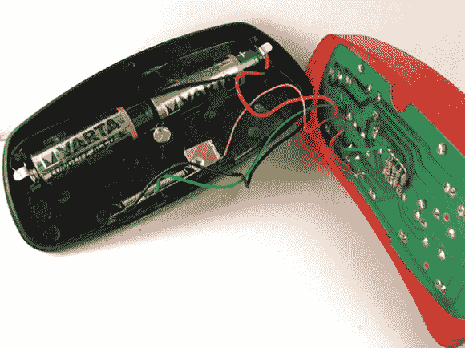

# 自行车灯出色的自动关闭功能

> 原文：<https://hackaday.com/2013/02/06/brilliant-auto-off-feature-for-a-bike-light/>

如果你打算在晚上用你的自行车作为交通工具，你真的必须有一个头和尾灯，希望疯狂的司机不会撞到你。有充分的理由，这些灯不会自己关掉。但是[Miceuz]总是忘记在到达时关闭它，并且总是以没电结束。他对实际可行的自动关机功能的探索以[一个出色而简单的附加电路](http://wemakethings.net/2013/02/03/auto-off-bike-light/)告终。

他首先想到使用加速度计，但找不到不添加微控制器的合适的加速度计。他想出了一个更简单的电路，可以在黑色塑料外壳的底部看到。这是一个贴着小弹簧的覆铜板。弹簧完成了驱动 MOSFET 的 RC 定时器电路。当该电路充电时，MOSFET 将电源连接到自行车灯。当上限用完时，MOSFET 阈值会切断电源，一切都会关闭。由于弹簧在骑车时会抖动，所以它提供了给电容器充电所必需的瞬间连接。保持静止大约 30 秒钟，自动关闭开始。