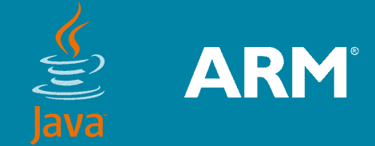

# 将 Java 带入微控制器的世界

> 原文：<https://hackaday.com/2012/10/09/bringing-java-to-the-world-of-microcontrollers/>

c 语言是一门漂亮的语言，非常适合在低功耗设备上开发，比如 8 位微控制器。随着更新、更强大的 ARM 微控制器进入世界各地的市场和工作台，甲骨文公司参与其中是再合适不过的了。他们[发布了针对这些更新、更强大的微控制器的 Java](http://www.oracle.com/us/corporate/press/1851573) 版本，名为 [Java ME embedded](http://www.oracle.com/us/technologies/java/embedded/micro-edition/overview/index.html) 。

新的嵌入式 Java 版本拥有您期望从微控制器开发平台获得的一切——访问 GPIO 引脚，包括 SD 卡和 I2C 设备。新的 Java 机器是为全无头操作而设计的，能够在只有 130 kB RAM 和 350 kB ROM 的设备上运行。

至于用 Java 编写微控制器的实用性，它仍然是第二受欢迎的语言，在过去十年的大部分时间里，它都是程序员选择使用的第一语言。新的嵌入式 Java 版本的要求太大，甚至无法适应最好的 8 位微控制器，但随着新一代更强大的 ARM 设备的出现，我们预计在未来几个月将会看到越来越多的 ARM/Java 项目进入 Hackaday tip 系列。

向[罗杰]致敬，因为他送来了这个。