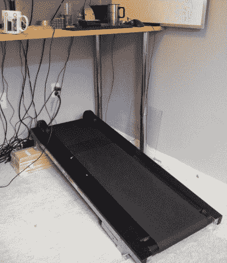

# 一步一步地浏览网页

> 原文：<https://hackaday.com/2013/08/23/browsing-the-web-one-step-at-a-time/>

在改造了他的新的手动跑步机以适合他站立的办公桌后，[Brian Peiris]找到了一种让他在互联网上漫步的方法。

在移除跑步机的原始时间/距离显示器后，[Peiris]对速度传感器进行了逆向工程，以将数据发送到 Arduino 和他的 PC。我们已经看到了许多将跑步机与虚拟世界连接起来的项目，但真正让这个项目脱颖而出的是一个使用 Throxy Python 库的简单脚本，它允许跑步机节流他的机器的互联网连接。

最终结果是浏览体验对用户的运行速度做出反应。在演示视频中，你可以看到 Peiris 踮着脚浏览图像，或者慢跑浏览 YouTube 视频。最小带宽设置使连接保持活跃，所以如果你不能看完那部高清网飞电影，休息一下也不会使连接超时。

这当然是一个很好的健身方式，或者至少，它会让你的 ISP 的带宽上限感觉更大。

跳跃后的视频。

[https://www.youtube.com/embed/dJ-2ML3-_pA?version=3&rel=1&showsearch=0&showinfo=1&iv_load_policy=1&fs=1&hl=en-US&autohide=2&wmode=transparent](https://www.youtube.com/embed/dJ-2ML3-_pA?version=3&rel=1&showsearch=0&showinfo=1&iv_load_policy=1&fs=1&hl=en-US&autohide=2&wmode=transparent)