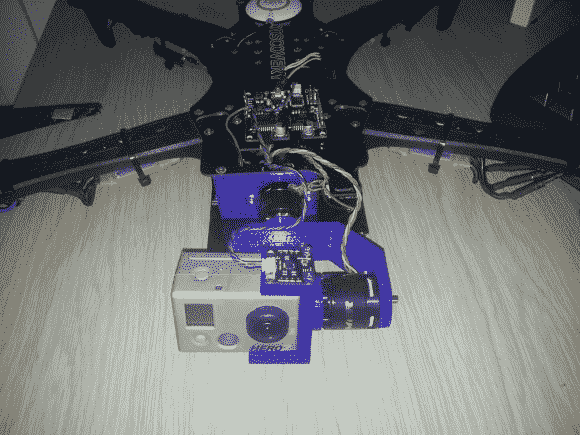
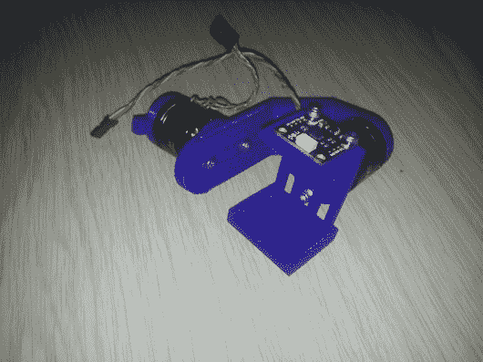
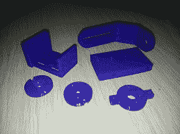
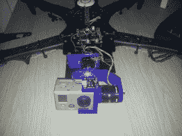

# 无刷万向节三维印刷和螺栓连接到四轴飞行器

> 原文：<https://hackaday.com/2013/06/18/brushless-gimbal-3d-printed-and-bolted-to-quadcopter/>

一些 3D 打印部件、一些无刷电机和一些控制硬件[为这台四轴飞行器](http://www.youtube.com/watch?v=ZYVLWC1AEG4)增添了一种电影摄影的风格。

[Sean]在看到[昨天的无刷万向架](http://hackaday.com/2013/06/17/brushless-motor-camera-gimbal/)被用于提高肩扛式相机的图像稳定性后，发来了一个关于他工作的提示。该钻机是为四轴飞行器设计的，这篇黑客文章说明了原因。从演示片段中可以明显看出，直接安装在 TBS Discovery 四轴飞行器框架上的万向节在保持图像稳定方面做得非常好。与飞行物理相反的平移和倾斜方向会带来更有趣的视频体验。观看插图视频，这是从飞机到飞行员的现场直播。由于四轴飞行器做了非常剧烈的倾斜转弯，你甚至无法分辨出 HQ 版本的俯仰或横滚是否发生了变化。

你可以看到一对详细描述 3D 打印零件和下面组装的万向节的图像。

[https://www.youtube.com/embed/ZYVLWC1AEG4?version=3&rel=1&showsearch=0&showinfo=1&iv_load_policy=1&fs=1&hl=en-US&autohide=2&wmode=transparent](https://www.youtube.com/embed/ZYVLWC1AEG4?version=3&rel=1&showsearch=0&showinfo=1&iv_load_policy=1&fs=1&hl=en-US&autohide=2&wmode=transparent)

     