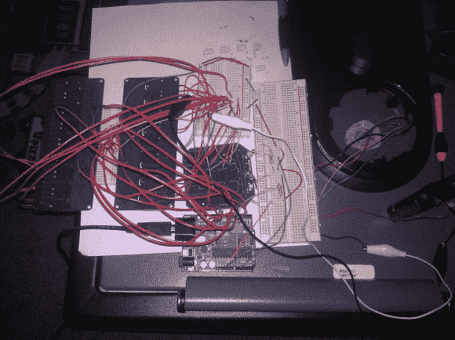

# 蛮力找到电子保险箱丢失的密码

> 原文：<https://hackaday.com/2013/01/21/brute-force-finds-the-lost-password-for-an-electronic-safe/>

[茶树]讲述了一个关于丢失消防保险箱密码的悲伤故事。电子键盘带有制造商代码以及用户选择的组合。尽管他安全地保存了用户手册*和*并通过电子邮件将密码发送给了自己，但不知何故，他还是把它们都弄丢了。他不想破坏保险箱来打开它，向制造商求助看起来像是一种逃避。但是他确实设法通过暴力破解电子键盘让[恢复了密码。](http://forums.hackaday.com/viewtopic.php?f=3&t=3040)

有内置的暴力保护，但它有一个主要的缺陷。如果密码连续三次输入错误，系统会强制锁定两分钟。但是你可以通过切断电源来解决。[Teatree]将一个继电器焊接到每组键盘触点，另一个焊接到电源线，并开始编写一些代码，以便他的 Arduino 可以开始尝试每一种可能的组合。他甚至编写了一个系统向他发送电子邮件更新。仅仅六天的持续攻击就让他获得了正确的密码。